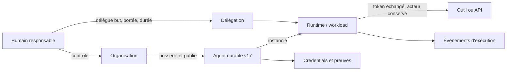
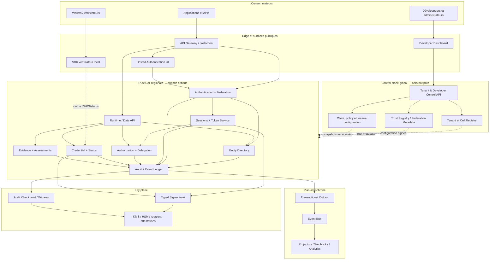
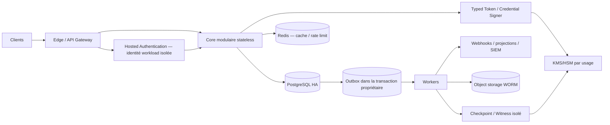
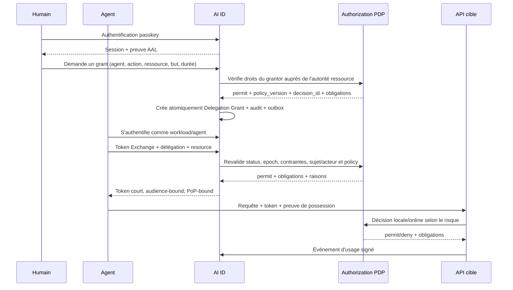
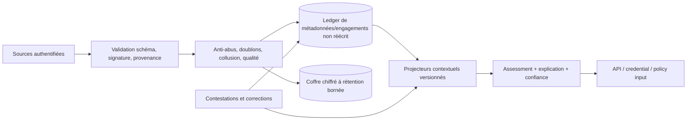

# AI ID — Étude comparative et architecture de référence

**Statut :** proposition pour décision — aucune implémentation engagée  
**Date de référence :** 20 juillet 2026  
**Portée :** phase 1 uniquement — analyse du marché, des standards, des risques et choix d’architecture  
**Décision demandée :** valider ou amender les décisions ADR-001 à ADR-008 avant le plan de développement

---

## 1. Résumé exécutif

AI ID ne devrait pas devenir « un compte universel de plus ». Une telle approche créerait un point de corrélation mondial, une autorité centrale trop puissante et une cible systémique. La proposition retenue est une **infrastructure fédérée de confiance**, compatible avec les fournisseurs d’identité existants, qui sépare cinq responsabilités aujourd’hui trop souvent confondues :

1. identifier une entité persistante ;
2. authentifier un principal qui agit ;0
3. prouver des attributs ou des faits ;
4. autoriser une action dans un contexte précis ;
5. produire une évaluation de confiance explicable et contestable.

L’architecture recommandée est un **hybride fédéré et cellulaire** :

- un IdP et un broker conformes aux standards pour offrir une adoption immédiate ;
- un modèle d’entité universel, distinct des comptes de connexion ;
- des domaines de confiance fédérés plutôt qu’une racine mondiale unique ;
- des credentials portables et vérifiables lorsque leur usage apporte une vraie valeur ;
- une autorisation ReBAC + ABAC, indépendante des tokens ;
- une réputation contextuelle fondée sur des preuves, jamais un score mondial unique ;
- des cellules régionales autonomes pour isoler les pannes, les tenants et les juridictions ;
- un cœur initialement livré comme **monolithe modulaire**, avec Hosted Authentication, Signer et témoin d’audit déjà isolés comme frontières de sécurité ; les autres modules ne sont extraits que lorsque la charge, l’isolation ou l’organisation le justifient.

La différenciation d’AI ID ne sera pas « le login ». Le login est un prérequis devenu largement standardisé. Le produit défendable est le **graphe de contrôle et de délégation entre humains, organisations, agents et workloads**, enrichi par une couche de preuves et d’évaluations de confiance portables.

### Recommandation de périmètre initial

Le premier marché doit couvrir correctement trois familles :

- les humains ;
- les agents IA, avec leur contrôleur et leur chaîne de délégation ;
- les services/workloads logiciels.

Ce triptyque est un périmètre technique, pas encore un marché. Le wedge recommandé est précis : **des APIs qui acceptent des agents agissant sous délégation explicite d’un humain ou d’une organisation**. Les robots et objets connectés doivent être prévus dans le modèle, mais intégrés ensuite au moyen de profils spécialisés (attestation matérielle, RATS/EAT, ACE-OAuth, FIDO Device Onboard). Les traiter tous à égalité dès le MVP diluerait l’effort de sécurité et empêcherait d’obtenir un produit réellement exploitable.

---

## 2. Méthode et critères

Cette étude distingue :

- les **faits documentés**, reliés à une source primaire ou à la documentation officielle ;
- les **inférences architecturales**, signalées comme telles ;
- les **choix proposés**, qui doivent être validés avant implémentation.

Les solutions sont évaluées selon neuf axes : interopérabilité, sécurité, modèle multi-entité, fédération, autorisation, audit, portabilité, expérience développeur et exploitabilité mondiale. Les fonctions marketing ne sont pas considérées comme des garanties de sécurité ; les versions preview ou les brouillons de standards sont isolés derrière des adaptateurs.

Dans les tableaux comparatifs, les fonctionnalités citées relèvent des sources officielles ; les colonnes « limites », « à améliorer » et « à ne pas reproduire » sont des analyses architecturales AI ID, même lorsque le mot *inférence* n’est pas répété dans chaque cellule.

**Terminologie :** `Entity`, `Principal`, `Authenticator`, `Credential`, `Grant`, `Delegation`, `Evidence`, `Assessment`, `Trust Domain`, `Policy Enforcement Point` (PEP) et `Policy Decision Point` (PDP) sont conservés en anglais car ils constituent les futurs noms de contrats/API. Le texte français emploie « liaison fédérée », « expurgation », « adaptateur », « lisible par machine » et « refus par défaut » hors des noms normatifs ou citations produit.

### Principes non négociables

- **Standards d’abord, extensions ensuite.** Une extension AI ID ne doit jamais casser un client OIDC/OAuth standard.
- **Minimisation des données.** La plateforme ne collecte pas une donnée simplement parce qu’elle pourrait être utile plus tard.
- **Pas de confiance implicite.** Authentification, preuve d’identité, autorisation et réputation sont des décisions différentes.
- **Portabilité vérifiable.** L’export d’un JSON propriétaire ne suffit pas ; un tiers doit pouvoir vérifier sans appeler AI ID pour chaque opération.
- **Sécurité symétrique.** Les primitives essentielles — passkeys, audit, rotation des sessions, export et révocation — ne peuvent pas être des options premium.
- **Explicabilité et recours.** Une décision de confiance ayant un effet matériel doit exposer sa provenance, sa fraîcheur, sa politique et un mécanisme de contestation.

---

## 3. Repenser la vision initiale

### 3.1 « Identité universelle » ne doit pas signifier « identifiant public mondial »

Un identifiant global stable permettrait la corrélation des activités d’une personne ou d’un agent entre services. Il deviendrait aussi un secret mal employé : lorsqu’il fuit, il ne peut plus être remplacé. OIDC prévoit déjà des identifiants de sujet *pairwise*, calculés selon un `sector_identifier`, afin qu’un même utilisateur apparaisse sous des identifiants différents selon le secteur ([OpenID Connect Core Errata 2](https://openid.net/specs/openid-connect-core-1_0-errata2.html)).

**Proposition :** universaliser le **modèle** et les **protocoles**, pas le numéro exposé. Une Entity est locale à un trust domain ; son identité interne complète est `(trust_domain_id, entity_id)`, opaque et non réassignable. AI ID n’effectue aucune fusion, déduplication ou recherche cross-tenant par défaut. À l’extérieur, une référence est le couple `(issuer, subject)` dans le contexte du RP/secteur concerné ; le `sub` est pairwise, non réassignable et stable malgré la rotation des clés de dérivation. Un handle public ou un DID est un alias optionnel, jamais la clé primaire.

Une association cross-domain est explicite, finalisée, révocable, consentie ou fondée sur une autre base légale. Elle reste isolée des projecteurs de réputation par défaut. Un éventuel compte racine d’authentification est séparé des Entities exposées aux tenants : les pairwise IDs empêchent la corrélation par les RPs, tandis que séparation des domaines, contrôle d’accès et minimisation réduisent aussi la capacité de corrélation de l’opérateur AI ID.

Par défaut, il n’existe pas de table globale « humain → toutes ses Entities ». Une session SSO managée peut broker une authentification vers un trust domain sans fusion persistante des représentations ; les liens locaux restent dans leur cellule, chiffrés et accessibles seulement au flow d’authentification du domaine concerné. La recherche, l’analytics, la réputation et le support cross-domain sont interdits. Toute récupération globale ou portabilité assistée devient une fonction opt-in distincte, avec consentement/base légale, step-up et audit.

### 3.2 Une entité, un compte, un client OAuth et un processus ne sont pas la même chose

Le modèle traditionnel `user` / `service account` ne suffit pas. Pour un agent autonome, quatre réalités coexistent :

- l’agent durable, défini et versionné ;
- l’instance d’exécution momentanée ;
- le propriétaire ou contrôleur déclaré/vérifié selon une assurance explicite ;
- l’autorité déléguée pour une tâche et une durée données.

Les confondre rend impossible l’audit causal : on sait quel token a appelé une API, mais pas au nom de qui, sous quelle délégation, avec quelle version d’agent. AI ID doit donc séparer **Entity**, **Principal**, **Controller**, **Credential**, **Session** et **Delegation**.

### 3.3 L’authentification n’est ni une preuve d’identité ni une autorisation

Une passkey prouve le contrôle d’une clé liée à un compte ; elle ne prouve pas un nom légal. Une pièce vérifiée peut attester un attribut ; elle n’autorise aucune action. Un score de confiance ne doit jamais, seul, accorder un droit. Les niveaux IAL/AAL/FAL de NIST 800-63-4 rendent ces dimensions explicitement distinctes ([NIST SP 800-63-4](https://www.nist.gov/publications/nist-sp-800-63-4-digital-identity-guidelines)).

**Proposition :** chaque politique demande séparément un niveau d’authentification, des preuves acceptables, une relation ou permission, et éventuellement un seuil d’évaluation contextuelle.

### 3.4 La réputation mondiale est une mauvaise primitive

Une note unique est manipulable, opaque et injuste. La fiabilité d’un agent pour résumer du droit français ne dit rien de sa capacité à piloter un robot. Les systèmes ouverts sont en outre exposés aux attaques Sybil : un acteur crée de nombreuses identités pour fabriquer un consensus ([The Sybil Attack](https://www.microsoft.com/en-us/research/publication/the-sybil-attack/)).

**Proposition :** conserver des **preuves signées et attribuées**, puis calculer des évaluations par contexte. Toute évaluation retourne au minimum : contexte, résultat, confiance statistique, taille d’échantillon, diversité des sources, fraîcheur, modèle et version, explication et statut de contestation. EigenTrust apporte des idées utiles sur la transitivité et l’ancrage de confiance, mais pas une vérité universelle ([article EigenTrust](https://nlp.stanford.edu/pubs/eigentrust.pdf)).

### 3.5 AI ID ne doit pas devenir une base centrale de biométrie

La possession de données biométriques et de documents bruts crée un risque juridique, sécuritaire et réputationnel disproportionné. Stripe Identity illustre une bonne séparation entre session de vérification, rapport, accès restreint et effacement ([Stripe Identity](https://docs.stripe.com/identity/verification-sessions)).

**Proposition :** au départ, orchestrer des fournisseurs de vérification et conserver seulement le résultat minimal, la provenance, la date, le niveau d’assurance et une référence révocable. N’héberger des preuves brutes que pour un cas réglementaire explicite, dans un coffre séparé à rétention courte.

### 3.6 « Ouvert » exige plus qu’un dépôt public

Un standard mondial nécessite des spécifications versionnées, des profils d’interopérabilité, une suite de conformité, des jeux de test, un processus de gouvernance et au moins un vérificateur de référence indépendant. L’OpenID Foundation montre l’importance de la certification des implémentations, pas seulement de la publication d’un protocole ([programme de certification OpenID](https://openid.net/certification/)).

### 3.7 Thèse produit révisée

> **AI ID est un tissu fédéré de confiance qui permet à une entité numérique d’établir qui elle est, qui la contrôle, au nom de qui elle agit, quelles preuves la concernent et ce qu’elle est autorisée à faire — sans imposer un identifiant mondial ni une autorité de réputation unique.**

---

## 4. Modèle conceptuel de référence

| Concept | Rôle | Exemple | Invariant principal |
|---|---|---|---|
| **Entity** | Objet persistant local à un trust domain auquel des faits peuvent être rattachés | humain, agent, organisation, API, robot | Identifiant opaque jamais réutilisé dans son domaine |
| **Principal** | Acteur de sécurité authentifié au moment d’une requête | humain, agent ou workload | Lié immuablement à exactement une Entity actrice ; agir pour une autre exige une délégation |
| **Controller** | Relation de contrôle technique ou responsabilité revendiquée/vérifiée | entreprise contrôlant un agent | Type, émetteur, juridiction, assurance, dates et révocation explicites |
| **Authenticator** | Moyen de prouver le contrôle d’un principal | passkey, clé matérielle, mTLS | Cycle de vie et assurance propres |
| **Credential** | Attestation vérifiable émise par une autorité | diplôme, statut KYC, capacité d’agent | L’émetteur et le schéma sont toujours identifiables |
| **Session** | Continuité d’une authentification | session navigateur ou device | Révocable, bornée, liée à une assurance |
| **Grant** | Autorisation consentie à un client | scopes OIDC | Ne peut dépasser le consentement et la politique |
| **Delegation** | Autorité transmise par un acteur à un autre | humain → agent → outil | Ne peut jamais élargir l’autorité parente |
| **Relationship** | Arête durable d’autorisation | membre, owner, maintainer | Portée par tenant/domaine et versionnée |
| **Evidence** | Observation ou assertion non réécrite logiquement | transaction réussie, incident signé | Provenance, temps, intégrité, rétention et rectification explicites |
| **Assessment** | Projection contextuelle sur des preuves | confiance pour « paiement ≤ 50 € » | Reproductible pendant la rétention autorisée depuis un snapshot et un modèle |
| **Trust Domain** | Frontière d’émission et de gouvernance | `acme.example` | Les vérificateurs choisissent les domaines acceptés |

`entity_kind` (`human`, `agent`, `organization`, `service`, `device`, etc.) sert à sélectionner des workflows et des schémas. Ce champ **n’accorde jamais de permission**. Les capacités proviennent de relations, politiques, délégations et credentials vérifiés.

Un Principal possède zéro à plusieurs Authenticators. Les Authenticators peuvent tourner sans changer le Principal ; leur partage entre plusieurs Principals est interdit. Le binding `Principal → Entity` est immuable pendant toute la vie du Principal. Un changement d’Entity crée un nouveau `principal_id` et révoque sessions, tokens et grants de l’ancien ; un lien de succession historisé ne modifie jamais la sémantique des artefacts déjà émis. Une relation Controller ne constitue pas, à elle seule, une conclusion de responsabilité juridique : elle est qualifiée `claimed`, `organization-asserted`, `contract-verified` ou `authority-verified` selon sa provenance.

### Identité d’un agent IA



Le journal doit répondre à quatre questions différentes : **quelle entité** est concernée, **quel principal** a exécuté l’action, **quel contrôleur** en répond et **quelle chaîne de délégation** l’autorisait.

#### Profil minimal d’un agent

- **Agent Entity** : identité durable, publisher, controller/sponsor, finalité déclarée et politique de cycle de vie.
- **Agent Release** : version, digest des artefacts/configuration, modèle(s) déclaré(s), capacités demandées, provenance de build et statut de sécurité.
- **Deployment** : environnement, organisation opératrice, région et policy bundle.
- **Runtime Principal** : instance éphémère attestée, authentifiée par workload identity et liée à un deployment précis.
- **Delegation** : tâche, finalité, ressources, limites, durée, approbateur et chaîne d’acteurs.
- **Execution Receipt** : résultat signé ou référencé, hashes et références vers un coffre opt-in plutôt que les entrées/sorties par défaut, outil appelé, décision et version d’agent.

L’identité durable peut survivre à une nouvelle version, mais la réputation ne doit pas être transférée aveuglément : un assessment peut être attaché à l’agent, à une release, à un opérateur ou à leur combinaison. Afficher « modèle X » est une déclaration ; seule une attestation de provenance/runtime acceptable peut en relever le niveau de confiance.

---

## 5. Étude comparative des plateformes

### 5.1 Fournisseurs cloud et plateformes développeur

| Solution | Forces à reprendre | Limites à améliorer | À ne pas reproduire |
|---|---|---|---|
| **Google Identity** | OIDC largement interopérable, consentement par scopes, découverte/JWKS, `sub` stable chez l’émetteur ([documentation OIDC](https://developers.google.com/identity/openid-connect/openid-connect)) | Identité principalement humaine et dépendance à un compte Google | Traiter l’email comme identifiant durable ou créer une dépendance à un fournisseur dominant |
| **Auth0** | Très bonne DX, Universal Login, Actions, connexions enterprise/sociales, détection de bots et attaques ([Attack Protection](https://auth0.com/docs/secure/attack-protection)) | Coût et complexité croissent avec B2B, organisations et extensibilité ; modèle centré user/client | Logique métier critique dans des hooks opaques ou multiplication de claims propriétaires |
| **Clerk** | Composants UI excellents, sessions ergonomiques, organisations, rôles/permissions et domaines vérifiés ([architecture Clerk](https://clerk.com/docs/guides/how-clerk-works/overview)) | Très orienté applications web et humains ; autorisation relationnelle limitée | Coupler la vérité d’identité à des composants front-end ou embarquer de longues permissions dans chaque session |
| **Okta** | Maturité enterprise, cycle de vie, fédération, politiques adaptatives et intégrations ([Universal Directory](https://help.okta.com/oie/en-us/content/topics/users-groups-profiles/usgp-about-profiles.htm)) | Administration complexe, coût, héritage de modèles workforce/customer séparés | Faire du catalogue d’intégrations le modèle de domaine ou multiplier des moteurs de politiques concurrents |
| **Microsoft Entra ID** | Tenants, Conditional Access, workload identities, managed identities et Continuous Access Evaluation ([workload identities](https://learn.microsoft.com/en-us/entra/workload-id/workload-identities-overview)) | Modèle et UX fortement liés à l’écosystème Microsoft | Confondre tenant, organisation et frontière de confiance ; imposer un cloud pour établir l’identité d’un workload |
| **AWS Cognito** | Intégration AWS, user pools, identity pools, fédération et montée en charge managée ([documentation Cognito](https://docs.aws.amazon.com/cognito/)) | Configuration et personnalisation difficiles, séparation user/identity pools déroutante | Deux modèles d’identité parallèles exposés au développeur ou des erreurs de configuration IAM faciles |
| **Firebase Authentication** | Onboarding extrêmement rapide, SDK client, émulateur, providers prêts à l’emploi ([Firebase Auth](https://firebase.google.com/docs/auth)) | Peu adapté au B2B complexe, aux workloads et à la portabilité | Faire de la base applicative ou d’un SDK propriétaire la frontière d’autorisation |
| **Cloudflare Access** | Zero Trust au bord, décisions contextuelles, service tokens, posture et signaux continus ([politiques Access](https://developers.cloudflare.com/cloudflare-one/access-controls/policies/)) | C’est un PEP/gateway, pas un registre universel de sujets ou de preuves | Déduire la confiance durable d’un contrôle réseau ponctuel |
| **GitHub Identity / Apps** | Distinction utile entre installation d’une app, autorisation utilisateur et permissions minimales ([autorisation des GitHub Apps](https://docs.github.com/en/apps/using-github-apps/authorizing-github-apps)) | Identité bornée à l’écosystème GitHub | Utiliser un PAT humain pour représenter un agent ou un service ; mélanger identité de l’app et de l’utilisateur |
| **Stripe Connect** | États de compte explicites, collecte progressive des exigences, capacités séparées, responsabilité de plateforme ([Account Capabilities](https://docs.stripe.com/connect/account-capabilities)) | Modèle spécialisé paiement/KYC et gouvernance centralisée | Un statut binaire « vérifié » sans motif, portée, date d’expiration ou voie de recours |
| **Stripe Identity** | Sessions de vérification, rapports structurés, contrôles séparés et expurgation ([Verification Sessions](https://docs.stripe.com/identity/verification-sessions)) | Données extrêmement sensibles et dépendance fournisseur | Stocker les documents bruts dans le domaine principal d’identité |
| **Descope** | Flows visuels composables, connecteurs et combinaison RBAC/ReBAC/ABAC ([Flows](https://docs.descope.com/flows), [Authorization](https://docs.descope.com/authorization)) | Orchestration hébergée et modèle propriétaire | Faire du graphe visuel l’unique source de vérité non versionnée/non testable |
| **Stytch** | Sessions hybrides, M2M et décisions de risque device `ALLOW/BLOCK/CHALLENGE` ([sessions](https://stytch.com/docs/consumer-auth/manage-sessions/overview), [device fingerprinting](https://stytch.com/docs/fraud-risk/device-fingerprinting/overview)) | Signaux antifraude propriétaires et implications de confidentialité du fingerprinting | Traiter un fingerprint ou verdict de risque comme une identité durable |

#### Lecture transversale

Les produits cloud excellent soit dans l’onboarding humain, soit dans l’intégration à leur propre écosystème. Aucun ne donne simultanément une sémantique de première classe aux humains, agents, workloads, contrôleurs, délégations et preuves portables. AI ID doit préserver leur niveau de DX sans reprendre leur gravité propriétaire.

### 5.2 Solutions open source ou auto-hébergeables

| Solution | Forces à reprendre | Limites à améliorer | À ne pas reproduire |
|---|---|---|---|
| **Keycloak 26.7** | Couverture OIDC/OAuth/SAML, brokering, Organizations, WebAuthn, service accounts et moteur de politiques ([release 26.7](https://www.keycloak.org/2026/07/keycloak-2670-released), [guide administrateur](https://www.keycloak.org/docs/latest/server_admin/index.html)) | Grande surface de configuration ; audit non inviolable ; plusieurs capacités récentes restent preview | Un realm par tenant par défaut, un cœur dépendant de fonctions preview, ou toute l’autorisation encodée dans les tokens |
| **ZITADEL 4.16** | Event sourcing/CQRS, historique causal, organisations/projets et délégation B2B ([releases](https://github.com/zitadel/zitadel/releases), [event store](https://zitadel.com/docs/concepts/eventstore/overview)) | Cohérence éventuelle à maîtriser, migration d’API, discipline opérationnelle du replay | Deux générations d’API actives ou un couplage de licence AGPL non décidé juridiquement |
| **FusionAuth 1.68** | Modèle Entity/Grant, sessions maîtrisables, webhooks transactionnels et linking fédéré prudent ([release notes](https://fusionauth.io/docs/release-notes), [Entities](https://fusionauth.io/docs/apis/entities/)) | Code propriétaire ; FGA, SCIM et plusieurs primitives derrière des offres commerciales | Placer les primitives de sécurité ou les identités non humaines derrière un paywall |
| **Supabase Auth 2.193** | SDK simple, rotation one-time des refresh tokens, `session_id`, AAL et intégration RLS ([releases](https://github.com/supabase/auth/releases), [architecture Auth](https://supabase.com/docs/guides/auth/architecture)) | Pas de modèle B2B/non-humain général ; fraîcheur des permissions liée aux JWT | Sessions illimitées par défaut ou métadonnées modifiables utilisées comme claims d’autorité |
| **Ory** | Excellentes frontières Kratos/Hydra/Keto/Oathkeeper, protocoles headless, ReBAC et séparation PEP/PDP ([Ory Hydra](https://www.ory.com/hydra)) | Assemblage et exploitation complexes ; fonctions production/B2B réparties entre OSS et offre commerciale | Faire assembler quatre vérités incompatibles au développeur ou réserver les correctifs critiques au produit commercial |

#### Ce que révèle l’open source

La meilleure synthèse n’est pas un fork :

- reprendre les frontières de domaines d’Ory ;
- la causalité et les projections de ZITADEL ;
- l’interopérabilité de Keycloak ;
- le modèle Entity/Grant et le linking explicite de FusionAuth ;
- la simplicité des SDK et des sessions de Supabase.

Le point aveugle reste le même : `user`, `service account`, `OAuth client` et `authorization subject` sont des objets séparés sans agrégat universel de contrôle, preuve, délégation et réputation.

### 5.3 Moteurs d’autorisation

| Approche | Apport | Limite | Usage recommandé |
|---|---|---|---|
| **Zanzibar / OpenFGA** | Graphe de relations, héritage, vérification `check/list/expand`, modèle éprouvé à très grande échelle ([papier Zanzibar](https://research.google/pubs/zanzibar-googles-consistent-global-authorization-system/), [modélisation OpenFGA](https://openfga.dev/docs/modeling/getting-started)) | Les conditions riches, preuves et obligations ne sont pas naturellement le cœur du modèle | Relations durables : owner, member, delegate, controller |
| **Cedar** | Politiques explicites, analysables, deny/forbid et contexte typé ([documentation Cedar](https://docs.cedarpolicy.com/)) | Nécessite un modèle de données et une distribution de politiques rigoureux | ABAC et conditions contextuelles au PDP |
| **OPA/Rego** | Général, cloud-native, intégrable aux gateways et au CI ([documentation OPA](https://www.openpolicyagent.org/docs)) | Langage puissant mais charge cognitive et risque de politiques difficiles à expliquer | Adaptateur de politiques/infrastructure, pas modèle public AI ID |
| **AuthZEN API 1.0** | Contrat standard PEP↔PDP, découplage du moteur ([spécification finale](https://openid.net/specs/authorization-api-1_0.html)) | Ne définit ni le langage ni le stockage des relations | API d’évaluation publique ou interne à adopter |

**Choix :** un seul service de décision utilise ReBAC pour les relations stables et des conditions ABAC bornées pour le contexte/les obligations, derrière une API compatible AuthZEN. Le MVP n’assemble pas deux moteurs indépendants ; un adaptateur Cedar ne sera ajouté qu’avec une sémantique formelle de composition et des tests de non-contradiction. Le token transporte l’identité, l’audience et quelques capacités bornées ; il n’embarque pas le graphe complet des droits.

---

## 6. Standards et projets de référence

### 6.1 Règle d’adoption

AI ID doit publier des **profils d’interopérabilité** plutôt qu’annoncer une compatibilité vague. Chaque capacité est classée :

- **Baseline** : obligatoire et testée par conformité dès le premier produit ;
- **Haute assurance** : activable par profil lorsque le risque le demande ;
- **Extension stable** : intégrée après le socle, sans modifier son modèle ;
- **Expérimental** : adaptateur isolé, aucun invariant interne dépendant de lui ;
- **Observation** : veille uniquement.

### 6.2 Matrice de maturité au 20 juillet 2026

| Domaine | Références | Statut observé | Décision AI ID |
|---|---|---|---|
| Autorisation OAuth | OAuth 2.0, [Security BCP RFC 9700](https://www.rfc-editor.org/info/rfc9700/), PKCE | RFC publiées | **Baseline.** Code + PKCE S256 ; pas d’implicit ni de ROPC ; redirects exacts |
| OAuth 2.1 | [draft-ietf-oauth-v2-1-15](https://datatracker.ietf.org/doc/draft-ietf-oauth-v2-1/) | Brouillon actif, mise à jour 2 mars 2026 | Implémenter son sous-ensemble sûr, ne pas prétendre être conforme à un RFC inexistant |
| Identité fédérée | OIDC Core, Discovery, RP-Initiated Logout | Standards finaux largement déployés | **Baseline**, avec certification OpenID ciblée |
| Clients à haute assurance | [FAPI 2.0 Security Profile](https://openid.net/specs/fapi-security-profile-2_0-final.html), PAR RFC 9126 | Final depuis février 2025 | **Profil haute assurance** : PAR + PKCE + DPoP ou mTLS |
| Proof of possession | [DPoP RFC 9449](https://www.rfc-editor.org/info/rfc9449/), [OAuth mTLS RFC 8705](https://www.rfc-editor.org/info/rfc8705/) | RFC | Requis pour délégations et API à risque élevé ; bearer court toléré ailleurs |
| Autorisation riche | [RAR RFC 9396](https://www.rfc-editor.org/info/rfc9396/), Resource Indicators | RFC | Adopter pour exprimer action, ressource, montant, finalité et contraintes |
| Délégation | [Token Exchange RFC 8693](https://www.rfc-editor.org/info/rfc8693/) | RFC | Primitive stable pour échange borné ; préserver acteur et chaîne de délégation |
| Découverte de ressource | [OAuth Protected Resource Metadata RFC 9728](https://www.rfc-editor.org/info/rfc9728/) | RFC 2025 | Baseline pour annoncer l’authorization server et les audiences d’une API sans heuristique |
| JWT | [JWT Best Current Practices RFC 8725](https://www.rfc-editor.org/info/rfc8725/) | BCP | Baseline : typage explicite, allowlists d’algorithmes et règles distinctes par usage |
| Nouvelle génération | [GNAP RFC 9635](https://www.rfc-editor.org/info/rfc9635/) | RFC 2024, écosystème naissant | **Observation**, pas de dépendance MVP |
| Authentification humaine | [WebAuthn Level 3](https://www.w3.org/TR/webauthn-3/), FIDO2, passkeys | Candidate Recommendation 2026 ; écosystème mature | Passkey-first ; clés liées à l’appareil disponibles pour profils forts |
| Provisionnement | [SCIM RFC 7643/7644](https://www.rfc-editor.org/rfc/rfc7644.html) | RFC déployées | **Extension B2B stable post-Core** ; modèle d’extension AI ID publié |
| Fédération enterprise legacy | [SAML 2.0](https://www.oasis-open.org/standard/saml/) | Standard ancien mais incontournable | Adaptateur entrant ; OIDC privilégié en sortie |
| Fédération multi-émetteurs | [OpenID Federation 1.1](https://openid.net/specs/openid-federation-1_1-final.html) | Final mai 2026 | Cible pour trust chains et metadata policies ; déploiement progressif |
| Notification de changements de sécurité | [Shared Signals Framework 1.0](https://openid.net/specs/openid-sharedsignals-framework-1_0-final.html), CAEP et RISC | Finaux septembre 2025 | Extension stable ; le récepteur choisit son traitement, donc TTL/epoch/introspection restent nécessaires |
| Décision d’autorisation | [AuthZEN Authorization API 1.0](https://openid.net/specs/authorization-api-1_0.html) | Final janvier 2026 | Contrat PEP↔PDP recommandé |
| Assurance d’identité | [OIDC for Identity Assurance 1.0](https://openid.net/final-openid-connect-for-identity-assurance-specifications-approved/) | Final octobre 2024 | Profil pour communiquer preuves et niveaux de vérification |
| Credentials portables | [VC Data Model 2.0](https://www.w3.org/TR/vc-data-model-2.0/), Data Integrity | Recommandations W3C 2025 | Extension stable ; ne pas confondre signature et vérité du contenu |
| Émission/présentation VC | [OpenID4VCI 1.0](https://openid.net/specs/openid-4-verifiable-credential-issuance-1_0-final.html), [OpenID4VP 1.0](https://openid.net/specs/openid-4-verifiable-presentations-1_0-final.html), HAIP | Finaux 2025 | Profils portables prioritaires après OIDC ; conformance tests obligatoires |
| Divulgation sélective | [SD-JWT RFC 9901](https://www.rfc-editor.org/info/rfc9901) | RFC 2025 | Utilisable ; le profil SD-JWT VC reste isolé tant que son draft n’est pas final |
| Statut de credentials | [Bitstring Status List](https://www.w3.org/TR/vc-bitstring-status-list/) | Recommandation W3C 2025 | Supporter avec attention aux risques de corrélation |
| Identifiants décentralisés | DID Core 1.0 / [DID Core 1.1](https://www.w3.org/TR/did-1.1/) | 1.0 Rec ; 1.1 Candidate Rec 2026 | Alias/résolution optionnels ; aucune dépendance à une blockchain ou une méthode unique |
| Workloads | [SPIFFE/SPIRE](https://spiffe.io/docs/latest/spiffe-about/spiffe-concepts/) | Spécifications et implémentation matures | Adaptateur de premier rang vers workload principals et X.509/JWT-SVID |
| Appareils et attestation | [RATS RFC 9334](https://www.rfc-editor.org/rfc/rfc9334.html), [EAT RFC 9711](https://www.rfc-editor.org/rfc/rfc9711.html) | RFC | Profil ultérieur pour attester l’état matériel/logiciel |
| IoT contraint | [ACE-OAuth RFC 9200](https://www.rfc-editor.org/info/rfc9200/), FIDO Device Onboard | RFC / spécifications industrielles | Adaptateurs post-MVP ; ne pas imposer le stack web à tout device |
| Devices sans navigateur | [Device Authorization Grant RFC 8628](https://www.rfc-editor.org/info/rfc8628/), CIBA | RFC / final OpenID | Device flow pour CLI/terminal ; CIBA seulement pour approbations découplées justifiées |
| Audit vérifiable | [Certificate Transparency RFC 9162](https://www.rfc-editor.org/rfc/rfc9162.html), [Rekor/Sigstore](https://docs.sigstore.dev/logging/overview/) | Modèles déployés | Réutiliser Merkle/checkpoints/witnesses pour les preuves d’intégrité, sans publier les PII |
| Agents/MCP | [MCP Authorization 2025-11-25](https://modelcontextprotocol.io/specification/2025-11-25/basic/authorization) et drafts IETF agentiques | MCP stable sur OAuth ; drafts agent récents | OAuth audience-bound, aucun token passthrough ; sémantique agentique derrière un profil expérimental |
| Fédération navigateur | [FedCM](https://www.w3.org/TR/fedcm/) | Working Draft, comportements navigateur mouvants | Amélioration UX progressive, jamais unique voie de connexion |

### 6.3 Baseline normative proposée

Le profil **AI ID Core 1.0** devrait exiger :

1. des flows distincts : Authorization Code + PKCE S256 pour l’humain ; Client Credentials avec authentification asymétrique ou échange depuis SPIFFE pour un service agissant pour lui-même ; Token Exchange + RAR + audience/resource binding pour la délégation ; Device Authorization Grant lorsque le terminal ne dispose pas de navigateur ;
2. OIDC Core, Discovery, UserInfo, JWKS et logout standard ;
3. WebAuthn/passkeys, avec MFA de secours et récupération séparée ;
4. clients confidentiels par `private_key_jwt` ou mTLS, jamais par secret perpétuel si évitable ;
5. audience et ressource explicites, algorithmes autorisés en liste blanche, clés à usages séparés ;
6. access tokens courts, refresh tokens rotatifs à usage unique et détection de réutilisation ;
7. RFC 9457 et idempotency keys uniquement pour les APIs propriétaires de gestion/métier ; les endpoints OAuth/OIDC, SCIM et SAML conservent leurs erreurs normatives ;
8. pairwise subject identifiers par défaut ;
9. schémas AI ID ouverts et versionnés pour l’export des relations/preuves, et formats standards lorsqu’ils existent ;
10. suite de conformité publique couvrant les cas positifs **et** les attaques connues.

Pour les JWT access tokens publics, AI ID suit le profil RFC 9068 ; RFC 9207 protège contre l’issuer mix-up, RFC 8707 lie la ressource, RFC 8705 couvre mTLS et RFC 8252 les clients natifs. Chaque type d’artefact a un `typ`, des clés et un validateur dédiés : aucun validateur JWT générique n’accepte indifféremment ID token, access token, délégation ou credential.

Un profil annoncé « FAPI 2.0 » applique le profil complet et sa conformité est testée comme telle. DPoP ne couvre ni le corps ni la plupart des headers ; les opérations dont les paramètres sont matériels exigent en plus nonce anti-rejeu et signature de message/applicative, ou mTLS selon le risque.

### 6.4 Ce que les standards ne résolvent pas

- OAuth autorise une délégation technique ; il ne définit pas la responsabilité légale d’un agent.
- Un DID donne une méthode de résolution ; il ne prouve ni unicité, ni humanité, ni réputation.
- Une Verifiable Credential prouve l’intégrité et l’émetteur ; le vérificateur doit encore décider s’il fait confiance à cet émetteur et à cette affirmation. Le modèle VC 2.0 le rend explicitement dépendant de l’écosystème de confiance.
- Une attestation matérielle prouve un état mesuré, pas que le logiciel agira correctement.
- Une signature d’événement prouve qui l’a produit ; elle ne rend pas son contenu vrai.
- Aucun standard mature ne fournit aujourd’hui une réputation universelle ou une chaîne complète de responsabilité d’agent inter-fournisseurs.

La conséquence est importante : **AI ID doit standardiser les enveloppes, la provenance, les relations et les décisions, pas décréter la vérité.**

La vérification de credentials utilise des allowlists versionnées de formats, proof suites, schémas, contexts et méthodes DID. Les parsers sont sandboxés ; aucun context JSON-LD ou schéma réseau arbitraire n’est chargé dans le chemin de vérification. Holder binding, audience/domain/challenge, statut et fraîcheur sont contrôlés. Une vérification hors ligne accepte nécessairement une borne de fraîcheur de révocation ; elle ne promet pas une révocation immédiate.

---

## 7. Synthèse : reprendre, améliorer, refuser

### À reprendre

- OIDC/OAuth, discovery et certification de Google, Keycloak et Hydra.
- Passkeys et authentification phishing-resistant par défaut.
- Séparation app / installation / utilisateur délégué de GitHub Apps.
- Sponsor d’agent, blueprint et distinction `subject` / `actor` d’Entra Agent ID ([documentation Agent ID](https://learn.microsoft.com/en-us/entra/agent-id/agent-identities)).
- Capabilities, requirements et responsabilité explicite de Stripe Connect.
- Ledger causal et projections reconstructibles de ZITADEL.
- Relation-based authorization de Zanzibar/OpenFGA et décision contextuelle de Cedar/AuthZEN.
- PEP indépendant de Cloudflare Access/Oathkeeper.
- Sessions hybrides : token très court et état serveur révocable.
- SDKs et composants hosted/embedded/headless de Clerk, Supabase et Stripe.
- Workload identity attestée de SPIFFE, plutôt que comptes de service à secrets statiques.
- Portabilité sélective par VC/OID4VC lorsque le vérificateur bénéficie d’une vérification hors ligne.

### À améliorer

- Unifier les objets au moyen d’une Entity persistante, sans fusionner leurs moyens d’authentification.
- Donner une sémantique explicite à `controller`, `owner`, `sponsor`, `operator`, `subject` et `actor`.
- Rendre chaque délégation bornée par action, ressource, finalité, temps, audience et profondeur.
- Rendre les événements idempotents, versionnés par agrégat et rejouables ; authentifier le plan interne, signer les webhooks/checkpoints et les preuves externes selon leur frontière.
- Fournir un chemin de récupération plus strict que le login ordinaire ; la récupération est souvent le maillon faible des passkeys.
- Garantir *read-your-writes* aux opérations critiques, même si les projections analytiques sont éventuelles.
- Distinguer preuve brute, attestation, signal, assessment et décision.
- Prévoir export, révocation, expurgation, suppression et portabilité dès le schéma initial.

### À ne pas reproduire

- Un identifiant global corrélable ou basé sur l’email.
- Un faux compte humain pour chaque agent, robot ou API.
- Un unique tenant/région comme racine de toutes les identités.
- Des mots de passe ou client secrets longue durée comme voie recommandée.
- Des bearer tokens longs, multi-audiences et non révocables.
- Un graphe entier de permissions dans un JWT.
- Le linking automatique de comptes à partir d’un email non vérifié ou d’attributs faibles.
- Un score de réputation mondial, permanent ou auto-proclamé.
- La confusion entre volume d’activité, popularité, identité vérifiée et confiance.
- Des hooks arbitraires et synchrones dans le chemin critique sans sandbox, budget ni circuit breaker.
- Des fonctions de sécurité essentielles réservées à un plan commercial.
- Une dépendance centrale à un draft, une blockchain, un DID method ou un fournisseur de KYC.

---

## 8. Architectures envisagées

### Option A — IdP universel centralisé

AI ID héberge toutes les identités, authentificateurs, credentials, autorisations, réputation et journaux dans un service global unique.

**Atouts :** MVP rapide, expérience cohérente, transactions simples, données immédiatement disponibles.  
**Faiblesses :** point de panne et de compromission mondial, corrélation massive, souveraineté difficile, gouvernance de la réputation centralisée, adoption exigeant une migration complète.  
**Verdict :** rejetée comme destination ; acceptable seulement comme forme physique provisoire d’une première cellule.

### Option B — Couche de confiance au-dessus des IdP existants

AI ID ne gère ni login ni session ; il lie des identités externes, émet des attestations et calcule des évaluations.

**Atouts :** très différencié, moindre surface cryptographique initiale, adoption par fédération.  
**Faiblesses :** dépendance à la qualité des IdP, identité persistante et délégation incomplètes, UX fragmentée, incapacité à satisfaire seule le MVP demandé.  
**Verdict :** bonne stratégie d’intégration, insuffisante comme architecture complète.

### Option C — Réseau décentralisé DID/VC et wallets

Chaque entité contrôle un DID et un wallet ; AI ID fournit résolution, schémas, attestations et éventuellement registre public.

**Atouts :** portabilité, vérification hors ligne, pas de compte central obligatoire.  
**Faiblesses :** récupération de clés difficile, expérience utilisateur immature, fragmentation des DID methods, gouvernance des émetteurs toujours nécessaire, confidentialité et révocation délicates. Une blockchain n’apporte aucune preuve de véracité.  
**Verdict :** rejeter le « tout décentralisé » ; intégrer les credentials portables comme une capacité.

### Option D — Tissu de confiance hybride, fédéré et cellulaire

AI ID fournit un IdP/broker compatible, un modèle universel d’entités, un graphe de contrôle/délégation, des évaluations contextuelles et des credentials portables. Les données et clés vivent dans des cellules autonomes ; un control plane global distribue configuration et trust metadata sans être dans le chemin critique.

**Atouts :** adoption progressive, compatibilité, isolement, résidence des données, portabilité sélective, évolution par module.  
**Faiblesses :** modèle plus exigeant, cohérence inter-cellules, gestion de clés et fédération complexes, coût de conformité important.  
**Verdict :** **retenue**. C’est l’option la mieux alignée avec les critères et pondérations retenus pour concilier ambition mondiale et trajectoire MVP réaliste.

### Matrice de décision pondérée

Échelle : 1 (faible) à 5 (excellent). Le score final est sur 5. Les poids et notes sont des hypothèses de décision explicites, pas des mesures objectives ; une analyse de sensibilité devra les revalider lorsque le premier marché et les classes de sécurité seront fixés.

| Critère | Poids | A Centralisé | B Overlay | C Décentralisé | D Hybride cellulaire |
|---|---:|---:|---:|---:|---:|
| Sécurité et isolation | 25 % | 2 | 3 | 3 | 5 |
| Interopérabilité et portabilité | 20 % | 2 | 4 | 4 | 5 |
| Vitesse vers un MVP utile | 15 % | 5 | 4 | 2 | 4 |
| Scalabilité et résilience mondiales | 15 % | 2 | 3 | 4 | 5 |
| Gouvernance et confidentialité | 15 % | 1 | 3 | 4 | 4 |
| DX et coût opérationnel | 10 % | 4 | 3 | 2 | 3 |
| **Score pondéré** | **100 %** | **2,50** | **3,35** | **3,25** | **4,50** |

La note de D dépend d’une discipline importante : **ne pas construire immédiatement une flotte de microservices**. La logique est modulaire ; le premier déploiement reste volontairement compact.

---

## 9. Architecture de référence retenue

### 9.1 Vue logique



### 9.2 Control plane et data plane

Le **control plane global** est la source de vérité des tenants, domaines de confiance, applications, versions de politiques, routage vers cellules, metadata publiques et règles de déploiement. La Developer Platform et son dashboard sont ses surfaces de gestion. Les cellules ne possèdent que des snapshots signés et dérivés. Le control plane ne traite pas chaque authentification et ne détient pas les clés privées utilisables en clair.

La **trust cell régionale** possède les données opérationnelles et les références de clés protégées d’un ensemble de tenants. Elle peut continuer à authentifier, valider une session et décider une permission pendant une panne du control plane, à partir du dernier snapshot acceptable. Chaque tenant a une cellule d’origine ; les grands tenants ou régimes sensibles peuvent obtenir une cellule dédiée.

Chaque snapshot porte tenant, cellule, séquence monotone, hash du prédécesseur, `issued_at`, `not_before` et `expires_at`. La cellule persiste la plus haute séquence acceptée et refuse tout rollback. Les changements négatifs de sécurité — client désactivé, redirect retirée, clé compromise, issuer dé-trusté ou deny policy — ont une staleness maximale courte et un canal d’urgence monotone séparé. Après cette borne, toute opération dépendant de cette classe — authorization request, émission, validation d’issuer/session lorsque requise et décision PDP — échoue fermée. Seule la vérification d’un artefact autonome peut continuer jusqu’à son expiration si son profil l’autorise explicitement ; une configuration non critique peut rester stale plus longtemps.

Ce découpage évite qu’une panne de configuration mondiale bloque toutes les connexions. Il réduit aussi le blast radius et rend la résidence des données explicite. Le multi-région actif/actif global d’une même identité est différé jusqu’à l’existence d’un besoin réel, car il complexifie les invariants de session, de révocation et d’unicité.

### 9.3 Bounded contexts

| Module | Responsabilité | Possède | Ne possède pas |
|---|---|---|---|
| **Entity Directory** | Cycle de vie des entities, aliases, profiles minimaux, controllers, links | Entity, principal binding, tombstone | Mot de passe, token, permission calculée |
| **Authentication** | Enrollment, authentificateurs, passkeys, MFA, recovery, federation/brokering | Authenticator, factor state, federation link | Session longue, réputation |
| **Session & Token Service** | Sessions, grants, consent, code, refresh family, access/ID tokens, introspection | Session, grant, token metadata | Profil métier, graphe complet de droits |
| **Authorization & Delegation** | Relations, policies, decisions, chaînes de délégation | Relationship tuple, policy bundle, delegation | Authentificateurs, score global |
| **Credential Service** | Émission, présentation, status, schémas et issuer metadata | Credential metadata, status entry | Vérité intrinsèque du claim |
| **Evidence & Assessment** | Ingestion de preuves, anti-abus, projections de confiance | Evidence envelope, assessment, dispute | Autorisation finale, preuve brute non nécessaire |
| **Audit & Event Ledger** | Historique causal, preuve d’intégrité, export | Domain event, audit record, checkpoint | Logs de debug haute cardinalité |
| **Tenant & Developer Platform (control plane)** | Apps, clients, références de clés, webhooks, quotas, sandbox, dashboard | Source de vérité des tenant/client configs et snapshots | Clés de signature en clair, données opérationnelles de cellule |

Les frontières sont des contrats de code et de données dès le premier jour. Elles ne sont pas nécessairement des processus réseau, **sauf trois frontières de sécurité isolées dès le MVP** : Hosted Authentication, Token/Credential Signer et Audit Checkpoint/Witness. Une autre extraction future requiert une raison mesurable : profil de charge différent, isolation de sécurité, équipe autonome, exigence réglementaire ou indépendance de disponibilité.

### 9.4 Forme physique initiale

Le premier déploiement recommandé pour une cellule est volontairement simple :



PostgreSQL est la source transactionnelle de la cellule. Redis est reconstructible et ne contient aucune vérité durable. Chaque propriétaire de données écrit son outbox locale dans la même transaction que la mutation métier ; une extraction future conserve cette règle. Un worker la publie au moins une fois. Tous les consommateurs sont idempotents.

Le Core ne possède aucun droit générique `Sign(bytes)`. Le Signer reçoit une intention typée, choisit lui-même `alg`, `kid`, `iss` et les en-têtes, vérifie tenant, type d’artefact, audience, politique et quotas, puis audite chaque usage. Seule son identité workload peut invoquer les clés KMS correspondantes. La non-extractabilité d’une clé ne suffit pas : cette interface empêche qu’une compromission arbitraire du Core transforme le KMS en oracle de signature.

L’event sourcing intégral de chaque sous-domaine n’est pas imposé. Il apporte une valeur forte à l’audit, aux relations, aux délégations et aux preuves, mais alourdirait inutilement les tables techniques OAuth à très fort débit. Le compromis est :

- état transactionnel normalisé pour les chemins sensibles ;
- événement de domaine non réécrit logiquement et émis atomiquement pour chaque changement matériel ;
- projections reconstructibles pour lecture, recherche, webhooks et assessments ;
- snapshots et schémas d’événements versionnés.

### 9.5 Contrats de cohérence

| Opération | Garantie | Motif |
|---|---|---|
| Création et tombstone d’une Entity | Sérialisable dans sa cellule | Aucun ID réutilisé, pas de double création logique |
| Linking/unlinking d’identités | Fort + transaction audit/outbox | Évite pre-account takeover et états partiels |
| Rotation d’une famille de refresh tokens | Compare-and-swap atomique + grâce/idempotence très bornée | Tolère un retry concurrent légitime sans masquer une réutilisation |
| Révocation d’une délégation | Forte dans la cellule ressource ; TTL/epoch/signaux hors cellule | Une autorité retirée ne doit pas être réémise ; délai maximal explicite par profil |
| Relation/permission critique | Read-your-writes, décision sur version explicite | Empêche une élévation par projection périmée |
| Évaluation de réputation | Éventuelle et versionnée | C’est une projection, jamais la seule autorité |
| Recherche et analytics | Éventuelle | La latence est acceptable et isolée du login |
| Événements de sécurité | Version monotone obligatoire par agrégat | Gap ou ancien événement déclenche un refetch ; revoked/tombstoned sont monotones |
| Webhooks | Au moins une fois, `event_id` et version d’agrégat | Le destinataire déduplique, détecte les gaps et gère les retards |
| Configuration de control plane | Snapshot signé, monotone, anti-rollback et borné par classe | La cellule continue en mode dégradé sans réactiver une configuration retirée |

### 9.6 Plan de clés

Les clés sont séparées par **usage**, **tenant/domaine de confiance**, **environnement** et **région** :

- racines hors ligne ou fortement contrôlées ;
- clés de signature OIDC ;
- clés d’émission de credentials ;
- clés de signature des webhooks ;
- clés de checkpoints d’audit ;
- clés de chiffrement d’enveloppe des données ;
- clés ou certificats des workloads.

Chaque nouveau matériel de clé reçoit un `kid` unique, jamais réutilisé ; le `kid` ne reste stable que pendant la vie de cette clé exacte. Les périodes de chevauchement sont documentées et les anciens JWKS restent publiés assez longtemps pour vérifier les artefacts non expirés. Une clé compromise suit un mécanisme de retrait d’urgence distinct. Le refresh JWKS sur `kid` inconnu est throttlé et protégé contre le stampede. La rotation est automatisée et testée comme une fonction produit. Le control plane référence les clés ; il ne peut ni extraire leur secret du KMS/HSM ni demander une signature arbitraire.

### 9.7 Modèle multi-tenant

Un **tenant** est une frontière administrative et de données, pas une identité. Une **organization entity** peut exister dans un trust domain d’un tenant, contrôler d’autres entities et participer à des relations. Un **trust domain** est un namespace et une autorité d’émission/politiques. Ces concepts ne doivent pas être fusionnés, et une Entity n’est jamais globale au-delà de son trust domain.

Par défaut :

- isolation logique stricte avec `tenant_id` dérivé du contexte authentifié, jamais accepté sur parole depuis le body ;
- Row-Level Security ou mécanisme équivalent comme défense supplémentaire, pas unique contrôle ;
- chiffrement d’enveloppe et quotas par tenant ;
- cellules et sauvegardes régionales ;
- option de base/schema/cellule dédiée pour les niveaux supérieurs d’isolation ;
- opérations de support *just-in-time*, à double contrôle et intégralement auditées.

La home cell d’une **ressource** possède exclusivement les relations, politiques et grants applicables à cette ressource. Une identité étrangère y est une référence externe typée `(issuer, sub)` accompagnée d’une assertion validée ; sa cellule d’origine ne participe pas au check synchrone. Aucun parcours de graphe distribué inter-cellules n’est permis. Un grant cross-domain doit être émis ou explicitement accepté par l’autorité de la ressource après échange de token ; sa révocation est bornée par TTL, epoch/version et signaux, avec délai maximal documenté par classe de sécurité.

### 9.8 Flux d’authentification et de délégation



L’autorité effective à chaque saut est l’**intersection** de l’autorité du délégant, du consentement, des permissions propres de l’agent, de la politique de l’organisation, de l’audience cible et des contraintes de contexte. Une délégation ne peut jamais ajouter un droit absent du parent.

---

## 10. Identifiants, liaison fédérée et récupération

### 10.1 Identifiants

- `(trust_domain_id, entity_id)` : identité interne locale, opaque, aléatoire, non signifiante et jamais réutilisée ; la suppression laisse un tombstone minimal, non réassignable et sans attribut métier, traité comme donnée personnelle tant qu’une réidentification reste raisonnablement possible.
- `principal_id` : identifie un sujet de sécurité agissant ; ses Authenticators tournent sans nécessairement le changer.
- `(issuer, sub)` : référence externe OIDC canonique uniquement dans le contexte du RP/secteur où ce `sub` est valide.
- `pairwise_sub` : valeur stable dérivée selon un `sector_identifier`, jamais réassignée et non modifiée par une rotation de matériel de clé/sel.
- `handle` : nom public modifiable, non utilisé pour la sécurité.
- `did` : alias optionnel lié par preuve de contrôle et politique de méthode.

L’email, le numéro de téléphone, un certificat ou un nom de domaine sont des attributs/credentials changeants. Aucun n’est la clé primaire.

### 10.2 Liaison fédérée sécurisée

Un lien fédéré est l’association explicite `(issuer, sub) → Principal`; le Directory crée ensuite le binding immuable et historisé `Principal → Entity`. Il est créé seulement après une preuve d’authentification auprès de l’émetteur et une décision de liaison. L’égalité d’email ne suffit pas, même si l’email est indiqué comme vérifié : les règles de propriété, d’alias et de recyclage diffèrent entre fournisseurs.

Tout linking sensible exige :

1. une session AI ID récente et suffisamment forte ;
2. une authentification fraîche auprès du nouvel IdP ;
3. une vérification de collision et de récupération en cours ;
4. une confirmation utilisateur/administrateur adaptée ;
5. une mutation atomique, un audit et une notification hors bande ;
6. un unlink réversible tant qu’un autre moyen de récupération sûr existe.

### 10.3 Récupération

La récupération est traitée comme une opération plus risquée que le login. Elle ne doit pas rétrograder une identité passkey forte vers un simple email. Chaque Principal déclare dès l’enrollment un mode de garde : `personal`, `organization-managed` ou `workload-custodial`. Un administrateur ne peut récupérer qu’un Principal explicitement `organization-managed` dans son trust domain ; il ne peut ni prendre le contrôle d’une Entity personnelle/externe ni modifier son Controller.

Les options, selon ce mode, sont : passkey de secours, clé matérielle, quorum multi-parties autorisé à l’enrollment, codes hors ligne, puis procédure manuelle vérifiée et temporisée. Une récupération forte exige un seuil d’approbation, un délai, des notifications indépendantes, la suspension temporaire d’émission et la révocation des sessions, grants et délégations. Les facteurs nouvellement ajoutés n’obtiennent pas immédiatement tous les privilèges sensibles. L’absence de preuve suffisante peut conduire à une non-récupération plutôt qu’à une rétrogradation d’assurance.

### 10.4 Topologie WebAuthn

Le RP ID et les origins doivent être décidés avant tout enrollment. Le profil managé peut utiliser un RP ID AI ID partagé ; un trust domain à domaine personnalisé peut utiliser son propre RP ID après validation durable du domaine. Le transfert/perte d’un domaine, la migration d’origin et le changement de tenant exigent un flow de ré-enrollment, pas une simple modification de configuration. Les passkeys synchronisées, device-bound, avec ou sans user verification/attestation produisent des profils d’assurance distincts ; un fallback plus faible ne conserve jamais le même AAL.

---

## 11. Sessions et tokens

### Modèle retenu

- Une **root session stateful** conserve l’état, l’AAL, les authentifications, le device, le tenant actif, les risques et les causes de révocation. Le navigateur ne reçoit qu’un cookie opaque, `HttpOnly`, `Secure` et à portée minimale, qui référence cet état.
- Un **ID token** authentifie le résultat OIDC pour un client ; il possède son `typ`, ses audiences et son validateur, et n’est jamais utilisé comme token d’API.
- Un **access token JWT** signé et court permet la vérification locale pour les opérations ordinaires ; un **reference token opaque** est disponible lorsqu’une révocation immédiate, une moindre exposition de claims ou une décision online est prioritaire.
- Une **refresh token family** opaque, hachée au repos, tourne à chaque usage. Une fenêtre de grâce/idempotence très bornée tolère le retry exact d’une requête concurrente légitime ; toute autre réutilisation d’un ancêtre révoque la famille et déclenche un signal de risque.
- Session, grant et délégation possèdent des epochs monotones. Les opérations sensibles utilisent introspection ou contrôle de version online ; Shared Signals/CAE accélère la notification mais ne garantit ni livraison ni révocation.
- Les tokens destinés aux APIs à risque élevé sont liés à une clé par DPoP ou mTLS.

Un JWT contient le minimum nécessaire : `iss`, `sub`, `aud`, `exp`, `iat`, `jti`, `client_id`, `sid`, epochs pertinentes, niveau d’assurance, tenant/organisation active si pertinent et référence de délégation. `actor` reste le concept de domaine ; sa sérialisation RFC 8693 utilise le claim `act`, éventuellement imbriqué ou remplacé par une référence bornée. Les acteurs historiques servent à l’audit, pas à élargir une autorité. Le format d’un access token reste un contrat entre authorization server et resource server : les clients ne doivent pas en parser le contenu.

### Refus explicites

- pas d’algorithme choisi depuis le token sans allowlist ;
- pas de `none`, pas de confusion clé symétrique/asymétrique ;
- pas de bearer multi-audiences par défaut ;
- pas de refresh token en clair dans les journaux ou bases ;
- pas de token transmis par un agent à un outil si un échange audience-bound est possible ;
- pas de permission durable uniquement parce qu’elle apparaît dans un JWT encore valide.

---

## 12. Autorisation et délégation

### 12.1 Architecture PDP/PIP/PEP

- Le **PEP** intercepte la requête au SDK, gateway ou service.
- Le **PIP** assemble identité vérifiée, relations, credentials, session, risque et contexte de ressource.
- Le **PDP interne** distingue `permit`, `deny`, `indeterminate` et `not_applicable`, avec raisons et obligations. L’adaptateur AuthZEN 1.0 expose seulement `decision: true|false` : seul `permit` devient `true`; les trois autres états et toute obligation critique non supportée échouent fermés vers `false`, avec raisons/erreurs dans un profil `context` AI ID versionné.
- Le service métier applique les obligations : step-up, consentement, limite de montant, expurgation, journalisation renforcée ou présence humaine.

Une décision est identifiée par un `decision_id` et contient les versions du bundle de politiques, du snapshot de relations et des preuves pertinentes. Cela rend possible la reproduction d’un incident sans prétendre que toutes les entrées resteront éternellement accessibles.

### 12.2 ReBAC + ABAC

Le graphe relationnel répond aux questions structurelles :

```text
organization:acme#owner@entity:alice
agent:travel_bot#controller@organization:acme
account:budget_42#spender@agent:travel_bot
document:itinerary#viewer@organization:acme#member
```

Les conditions ABAC répondent au contexte : heure, géographie autorisée, AAL, état du device, montant, finalité, niveau de risque, présence d’une approbation ou fraîcheur d’un credential. La composition est déterministe : deny explicite prioritaire ; aucune entrée manquante/stale ne devient permit ; seules les obligations connues et applicables autorisent permit ; une obligation critique inconnue entraîne deny. Chaque décision fixe un consistency token minimal pour relations, politiques et preuves.

Le langage interne peut évoluer, mais l’API d’évaluation reste stable. Les politiques et schémas sont versionnés, lintés, testés sur cas positifs/négatifs, simulables sur trafic historique expurgé et déployés progressivement.

### 12.3 Objet Delegation

Une délégation contient au minimum :

| Champ | Sens |
|---|---|
| `delegation_id` | Identifiant opaque et révocable |
| `authorization_server`, `resource_authority` | Domaine émetteur et autorité contrôlant la ressource cible |
| `grantor_principal` | Principal dont une partie de l’autorité est transmise |
| `delegate_principal`, `client_id`, `cnf` | Acteur/client autorisé et clé de proof-of-possession |
| `actor_chain` | Chaîne causale compacte ou référence vérifiable |
| `authorization_details` | Actions et ressources structurées (RAR) |
| `purpose` | Finalité, contraignante seulement si la ressource en publie une sémantique vérifiable |
| `audiences` | Services destinataires exacts |
| `not_before`, `expires_at` | Fenêtre temporelle courte |
| `max_depth` | Nombre de sous-délégations autorisées, zéro par défaut |
| `constraints` | Montant, fréquence, géographie, modèle/runtime, approbation |
| `proof` | Signature/credential et méthode de vérification |
| `policy_version`, `decision_id` | Autorisation de création et contexte de décision |
| `parent_id`, `parent_hash` | Délégation parente et engagement, si autorisée |
| `revocation_epoch` | Version monotone contrôlée par l’autorité de ressource |
| `status` | active, suspended, revoked, expired |

Une délégation n’est pas un access token. C’est un grant traçable à partir duquel AI ID peut émettre un token très court pour une audience précise. Sa création et chaque échange sont autorisés par le domaine qui contrôle la ressource cible, jamais par la seule signature d’une Entity. L’autorité effective est l’intersection des droits du grantor, de la politique ressource, du consentement, du grant et du contexte ; un enfant est validé comme sous-ensemble du parent.

Le MVP fixe `max_depth = 0`, une seule autorité de ressource et aucune sous-délégation cross-trust-domain. RFC 8693 fournit le mécanisme d’échange mais pas cette sémantique d’atténuation ; AI ID publiera donc un profil normatif **Delegation Grant** et des tests de propriété `child ⊆ parent` avant d’autoriser toute profondeur supplémentaire.

### 12.4 Agents et outils

Le profil agent doit reprendre une discipline essentielle du protocole MCP : le token reçu par un serveur ne doit pas être relayé tel quel vers un serveur aval ; un nouveau token lié à la ressource doit être obtenu. Les drafts IETF 2026 sur les agents sont utiles pour explorer les reçus de délégation et l’ancrage humain, mais trop récents pour figer le cœur. AI ID expose donc des points d’extension et bâtit la première version sur OAuth, RAR, Token Exchange, DPoP/mTLS et SPIFFE.

---

## 13. Réputation : une couche d’évidence, pas un score social

### 13.1 Pipeline



### 13.2 Evidence envelope

Chaque preuve conserve :

- sujet et contexte visés ;
- émetteur et principal signataire ;
- type/schema versionné ;
- temps de l’observation et temps d’ingestion ;
- lien vers la transaction ou le receipt lorsque partageable ;
- méthode d’intégrité ;
- durée de validité et politique de révocation ;
- classification de confidentialité et finalité consentie ;
- qualité/source tier ;
- état : active, disputed, corrected, revoked, expired ;
- référence de correction plutôt qu’une réécriture silencieuse.

Le ledger append-only ne contient ni PII ni payload complet : seulement provenance minimale, statut, référence et engagement cryptographique salé/keyed. Le contenu nécessaire réside dans un coffre chiffré avec DEK par enregistrement et rétention explicite. Une rectification ajoute un événement ; un effacement détruit le payload/DEK, ajoute un marqueur et ne conserve que ce qu’une base légale autorise. Après effacement, AI ID peut prouver qu’une décision a existé sans promettre de la recalculer à partir de données supprimées.

Les avis arbitraires anonymes ne sont pas acceptés dans les projecteurs de confiance à fort impact. Une source peut rester pseudonyme vis-à-vis du sujet tout en étant authentifiée et redevable auprès du domaine de confiance.

### 13.3 Assessment

Exemple de réponse conceptuelle :

```json
{
  "context": "travel.booking.refund_under_500_eur",
  "subject": "iss:sub-or-pairwise-reference",
  "result": { "band": "established" },
  "confidence_band": "moderate",
  "evidence_coverage": "sufficient_for_context",
  "sample_size": 47,
  "source_diversity": 9,
  "freshness": "P14D",
  "evidence_cutoff": "2026-07-20T09:30:00Z",
  "model": "refund-reliability",
  "model_version": "3.1.0",
  "explanation_codes": ["CONSISTENT_OUTCOMES", "NO_RECENT_DISPUTE"],
  "status": "active",
  "appeal_url": "https://..."
}
```

Les valeurs exactes sont illustratives. Une probabilité numérique n’est exposée que si elle est statistiquement définie, calibrée et documentée ; par défaut, l’API retourne une bande, la couverture des preuves et des facteurs interprétables.

### 13.4 Défenses anti-Sybil et anti-gaming

- pondération par provenance et niveau d’assurance, jamais par nombre brut d’identités ;
- séparation entre preuve auto-déclarée et preuve indépendante ;
- limites de contribution par relation économique/technique ;
- détection de grappes, réciprocité artificielle et temporalité anormale ;
- diversité des sources et diminution des signaux corrélés ;
- coût ou ancrage vérifié pour les contextes exposés aux Sybil ;
- modèles robustes au retrait d’une source dominante ;
- publication des règles générales sans révéler toutes les défenses antifraude ;
- red team et mesure de disparités avant toute décision à fort impact.

### 13.5 Frontière avec l’autorisation

Un assessment est une **entrée** possible d’une politique, jamais une permission. La politique doit dire pourquoi ce contexte exige cette évaluation, quelle fraîcheur est acceptable, quelle alternative/step-up existe et comment gérer `unknown`. Une indisponibilité du module de réputation ne doit pas se transformer implicitement en `permit` ni exclure définitivement une identité nouvelle.

Cette frontière est aussi juridique. L’AI Act européen vise explicitement certaines pratiques de *social scoring* lorsque des données de comportement sont réutilisées hors contexte ou produisent un traitement défavorable injustifié/disproportionné ([règlement UE 2024/1689](https://eur-lex.europa.eu/eli/reg/2024/1689/oj)). Pour les personnes physiques, une décision fondée exclusivement sur un traitement automatisé et produisant des effets juridiques ou similaires peut en outre relever de l’article 22 du RGPD, avec notamment des garanties d’intervention humaine et de contestation ([RGPD, règlement UE 2016/679](https://eur-lex.europa.eu/eli/reg/2016/679/oj)). AI ID doit donc interdire contractuellement les usages hors contexte, classifier les cas d’usage à fort impact et exiger une revue juridique avant activation ; ce document ne constitue pas un avis juridique.

La réputation v1 est limitée à un contexte non réglementé, réversible et défini par le tenant. Emploi, crédit, logement, santé, éducation, accès à un service public essentiel et sanction automatique sont interdits par défaut jusqu’à DPIA, calibration validée, tests de disparité, gouvernance de recours et revue indépendante.

### 13.6 Portabilité

Les preuves redistribuables peuvent être émises comme credentials. Les données obtenues sous une licence ou un consentement qui interdit la redistribution ne le sont pas. Un export distingue clairement :

- faits émis par AI ID et vérifiables indépendamment ;
- faits tiers redistribuables ;
- références à vérifier auprès de leur émetteur ;
- assessments propres à un modèle AI ID, avec sa version ;
- données non exportables et justification juridique.

---

## 14. Événements, audit et transparence

### 14.1 Trois flux distincts

| Flux | But | Rétention/type |
|---|---|---|
| **Domain events** | Intégration et reconstruction de projections | Versionnés, non réécrits logiquement, minimisés |
| **Audit records** | Qui a fait quoi, au nom de qui, pourquoi et avec quel résultat | Longue durée selon politique, intégrité renforcée |
| **Telemetry** | Performance, erreurs, traces et défense opérationnelle | Courte durée, échantillonnable, pas une vérité métier |

Chaque mutation privilégiée écrit son nouvel état, son audit et son outbox locale dans une même transaction. Le succès API n’est retourné qu’après ce commit. Les événements internes sont authentifiés et protégés par le transport/broker ; ils ne sont pas nécessairement signés individuellement. Un webhook peut arriver plus tard ou plusieurs fois ; son `event_id` est stable. La signature couvre les octets bruts exacts, l’endpoint ID, l’event ID, le delivery ID et le timestamp — jamais une canonicalisation JSON laissée aux SDKs.

### 14.2 Intégrité vérifiable

L’audit utilise une chaîne de hachage par partition/tenant et produit périodiquement des checkpoints Merkle signés. Ces checkpoints sont copiés vers un stockage WORM et soumis, dans un intervalle maximal défini par classe de sécurité, à un témoin doté d’une identité et d’une clé indépendantes. Des reçus de checkpoint sont exportables par les clients. Les principes de Certificate Transparency et Rekor sont utiles : cohérence vérifiable, inclusion proofs et détection de réécriture, troncature ou fork.

AI ID ne doit toutefois jamais qualifier le journal d’« immuable » au sens absolu. Un administrateur disposant de tous les systèmes pourrait détruire les données ; la garantie réaliste est **tamper-evident**, répliquée, témoignée et soumise à séparation des pouvoirs. Les PII ne sont pas inscrites dans un journal public : on y ancre des engagements cryptographiques soigneusement conçus pour éviter les attaques par dictionnaire.

### 14.3 Schéma minimum d’audit

- `audit_id`, `event_id`, tenant et trust domain ;
- `occurred_at`, `recorded_at`, région/cellule ;
- entity cible, principal acteur, controller qualifié (`claimed`, `organization-asserted`, `contract-verified` ou `authority-verified`) et chaîne de délégation ;
- action, ressource, résultat et code de raison ;
- client, session, requête et correlation IDs ;
- méthode d’authentification et AAL ;
- décision/politique et versions de preuves ;
- diff expurgé et classification ;
- hachage précédent, checkpoint et signature.

Les secrets, tokens, données biométriques, documents et credentials complets sont interdits dans les logs. Les vues du dashboard appliquent elles-mêmes l’autorisation fine et produisent un audit de consultation.

---

## 15. API et expérience développeur

### 15.1 Surfaces

AI ID propose trois expériences qui utilisent le même backend :

- **Hosted** : écrans d’authentification, consentement, récupération et onboarding sécurisés ;
- **Embedded** : composants stylables aux frontières de sécurité explicites ;
- **Headless** : API complète pour équipes avancées, avec exigences de conformité plus fortes.

Le dashboard ne reçoit aucun privilège spécial : il consomme les mêmes APIs d’administration, avec permissions et audits. Une sandbox isolée, des fixtures, un simulateur de webhooks et des clés de test rendent l’intégration reproductible.

### 15.2 Discipline des APIs propriétaires AI ID

Ces règles s’appliquent aux APIs de gestion et métier propres à AI ID. Les endpoints OAuth/OIDC, SCIM et SAML conservent strictement leurs URLs, paramètres, statuts et formats d’erreur normatifs.

- HTTPS uniquement et authentification asymétrique privilégiée ;
- ressources stables, verbes HTTP conventionnels et transitions explicites pour les state machines ;
- version majeure dans le contrat propriétaire, période de dépréciation et changelog lisible par machine ;
- `Idempotency-Key` obligatoire/recommandée pour les créations et opérations financières ou irréversibles, selon le modèle éprouvé de Stripe ([idempotency](https://docs.stripe.com/api/idempotent_requests)) ; sa portée est `(tenant, principal/client, endpoint, key, hash du payload)` avec TTL, et une réponse sensible n’est jamais rejouée vers un autre principal ;
- pagination par curseur, filtres bornés et limites explicites ;
- erreurs propriétaires au format [RFC 9457 Problem Details](https://www.rfc-editor.org/rfc/rfc9457.html) avec code stable, request ID et remédiation sûre ;
- `ETag` / préconditions pour les mises à jour concurrentes ;
- webhooks signés, redélivrables, livrés au moins une fois et dédupliqués par `event_id` ; un egress broker contrôle DNS, bloque IP privées/link-local/metadata et rebinding, limite redirects, taille et timeout ;
- OpenAPI/JSON Schema/AsyncAPI comme artefacts générateurs, testés contre l’implémentation ;
- aucun champ sensible retourné par défaut ; expansion explicite et autorisée.

### 15.3 SDK

Le premier SDK serveur doit être fin : types générés, retries idempotents, validation des webhooks, cache JWKS/status sûr, vérification de tokens/credentials et primitives de décision. Il ne doit pas cacher OAuth derrière une abstraction propriétaire impossible à remplacer.

Un SDK navigateur ne conserve jamais de refresh token accessible au JavaScript lorsque le modèle BFF est possible. Les exemples de production utilisent cookies `HttpOnly`, `Secure`, `SameSite`, CSP stricte et protection CSRF. Les quickstarts incluent les échecs, la rotation, la révocation et le multi-tenant, pas seulement un happy path.

### 15.4 Conformance et compatibilité

Le produit publie :

- un profil normatif AI ID Core ;
- une matrice exacte de standards/endpoints ;
- une suite de conformité locale et hébergée ;
- des golden vectors de JWT, DPoP, webhooks, VC et audit proofs ;
- un vérificateur de référence open source ;
- un export/import documenté ;
- une politique de compatibilité et un calendrier de fin de vie.

---

## 16. Architecture de sécurité et de confidentialité

### 16.1 Modèle Zero Trust

NIST 800-207 rappelle que la confiance ne doit pas être accordée implicitement selon la position réseau ([NIST SP 800-207](https://csrc.nist.gov/pubs/sp/800/207/final)). Sa déclinaison cloud-native cite notamment les identités de workloads et SPIFFE ([NIST SP 800-207A](https://csrc.nist.gov/pubs/sp/800/207/a/final)). Pour AI ID :

- chaque appel inter-module est authentifié comme workload ;
- chaque ressource valide issuer, audience, tenant, action et contexte ;
- les réseaux privés réduisent l’exposition mais ne constituent jamais une permission ;
- les administrateurs et workers ont des identities distinctes, à privilèges minimaux ;
- la confiance est recalculée à chaque frontière pertinente et peut être retirée en continu.

### 16.2 Invariants vérifiables

1. Un `(trust_domain_id, entity_id)` supprimé n’est jamais attribué à nouveau.
2. Tout token est lié à un émetteur, une audience/ressource, un client, un sujet, une période et un usage de clé explicites.
3. Toute sous-délégation est un sous-ensemble strict ou égal de l’autorité parente.
4. Toute mutation privilégiée est authentifiée, autorisée et accompagnée atomiquement d’un audit/outbox.
5. Le tenant effectif vient du contexte authentifié et de la ressource ; jamais d’un identifiant de body seul.
6. Toute évaluation de réputation est reproductible, pendant la rétention légalement autorisée, depuis un snapshot de preuves et une version de modèle ; après effacement, seul un reçu non réversible peut subsister.
7. Expiration, révocation, suspension, récupération et rotation ont des états explicites ; aucune suppression silencieuse ne vaut révocation.
8. Aucune API du control plane/Core ne peut extraire une clé privée ou obtenir une signature arbitraire ; seul un Signer isolé accepte des intentions typées et autorisées.
9. Une suppression de PII préserve seulement un tombstone pseudonyme minimal et les éléments légalement nécessaires, avec séparation cryptographique et rétention explicite.
10. Une ambiguïté sur issuer, algorithme, audience, tenant, délégation ou politique entraîne un refus sûr.
11. Un événement dupliqué ne produit pas un second effet métier.
12. Une preuve valide cryptographiquement n’est acceptée que si son émetteur, son schéma, son statut, son audience et sa fraîcheur satisfont une politique explicite.
13. La cellule de la ressource est la seule autorité de décision sur ses relations/politiques ; aucun check d’autorisation ne parcourt synchroniquement plusieurs cellules.
14. Un administrateur ne récupère que les Principals `organization-managed` de son trust domain ; aucun pouvoir de support ne transforme implicitement une garde personnelle.
15. Aucun index, projecteur de réputation ou outil de support ne joint des Entities de trust domains différents sans association explicite, finalité et autorisation auditée.
16. Le binding `Principal → Entity` est immuable ; un changement crée un nouveau Principal et invalide l’autorité de l’ancien.

Ces invariants doivent devenir des tests de propriété et de concurrence, pas seulement de la documentation.

### 16.3 Menaces prioritaires

| Menace | Scénario | Contrôles architecturaux | Test/mesure |
|---|---|---|---|
| **Account takeover** | Phishing, credential stuffing ou récupération faible | Passkey-first, rate limit, risk signals, step-up, récupération temporisée | Campagnes phishing internes, taux de récupération frauduleuse |
| **Pre-account takeover** | Un attaquant pré-crée un compte avec l’email de la victime puis provoque un linking | Linking explicite, preuve fraîche des deux côtés, pas d’email comme identité | Suite dédiée de scénarios de linking |
| **Session theft/replay** | Cookie ou refresh token volé | Cookies protégés, rotation one-time, reuse detection, device/PoP binding | Tests de replay concurrent et télémétrie de familles |
| **OAuth mix-up/code injection** | Confusion d’issuer, redirect ou code | Issuer exact, PKCE, state/nonce, redirects exacts, PAR pour profil fort | OpenID conformance + tests adversariaux |
| **Token substitution** | Token émis pour une autre API/client | Audience/resource strictes, typage `typ`, clés par usage, DPoP/mTLS | Corpus de JWT invalides et cross-audience |
| **Cross-tenant access** | IDOR ou tenant fourni par l’appelant | Contexte tenant validé, filtre/RLS, IDs non séquentiels, tests matrice | Tests génératifs sur chaque endpoint |
| **Delegation laundering** | Agent cache son délégant ou élargit les scopes | Actor chain, intersection des autorités, max depth, exchange à chaque audience | Property test « child ⊆ parent » |
| **Confused deputy** | Un outil utilise son propre pouvoir pour un demandeur non autorisé | Resource indicators, purpose, audience-bound token, politique acteur+sujet | Tests multi-outils et multi-audiences |
| **Workload impersonation** | Secret CI volé ou pod compromis | SPIFFE/mTLS, attestation, clés éphémères, isolation runtime | Rotation/attestation chaos tests |
| **IdP metadata/JWKS attack** | SSRF, key confusion, cache poisoning | Allowlist HTTPS, résolution sécurisée, taille/redirect limites, cache pinning, alg allowlist | Fuzz metadata/JWK et tests SSRF |
| **Key compromise** | Clé de signature exposée | HSM/KMS, séparation usages, quorum admin, rotation/kill switch, courte durée | Exercice de compromission et mesure MTTR |
| **Signing-oracle abuse** | Une RCE demande au KMS un token valide | Signer isolé, intentions typées, IAM par clé/usage, quotas et audit d’usage | Tests d’intentions malformées et compromission simulée du Core |
| **Policy/snapshot rollback** | Ancienne redirect, clé ou politique permissive rejouée | Séquences monotones, predecessor hash, canal de deny/kill d’urgence | Tests rollback/fork et expiration de chaque classe |
| **Custom-domain takeover** | Domaine expiré ou DNS détourné réactive un RP/issuer | Validation continue, blocage de réattribution, preuves DNS/TLS et procédure de perte | Exercices de transfert/expiration de domaine |
| **Consent phishing / malicious issuer** | Un client ou issuer trompe l’humain ou injecte des claims | Vérification client/issuer, UI non ambiguë, allowlists et trust policy | Tests UX adversariaux et issuer hostile |
| **Webhook forgery/replay** | Faux événement ou redelivery mal gérée | Signature destination-bound, timestamp, secret/clé rotative, event ID | Golden vectors et test de rejeu |
| **Audit tampering** | Suppression/modification d’un incident | Hash chain, checkpoints signés, WORM, témoin externe, séparation des rôles | Vérification continue des proofs |
| **Reputation poisoning** | Faux avis, collusion, sources compromises | Provenance, source tiers, graph analysis, contestation, robustesse | Simulations Sybil et modèle sans source dominante |
| **Privacy correlation** | `sub`, status checks ou logs relient plusieurs services | Pairwise IDs, selective disclosure, caches/status privacy, minimisation | DPIA, tests de linkability |
| **Supply-chain compromise** | Dépendance, build ou image malveillante | Builds hermétiques, SBOM, signatures, provenance, pinning, scanners | SLSA/provenance checks et drills de rollback |
| **Insider/support abuse** | Accès opérateur aux identités | Accès JIT, double contrôle, expurgation, audit de consultation, alertes | Revues périodiques et enregistrements leurres |
| **Mass export/exfiltration** | Client, tenant ou opérateur extrait le graphe | Scopes d’export distincts, step-up, quotas, jobs async, alertes et watermark/receipt | Tests d’abus et seuils d’exfiltration |
| **Backup resurrection** | Une restauration réactive clé, session, grant ou credential révoqué | Journal monotone séparé des revocations/epochs et replay avant trafic | Restore drills avec tombstones post-snapshot |
| **Prompt/tool injection** | Un agent authentifié détourne un outil malgré une délégation valide | Outils bornés, validation d’arguments, sandbox, approbations et politiques de sortie | Red team agentique ; l’identité ne prouve pas le respect de l’intention |
| **Denial of service** | Login/crypto/reputation saturés | Edge limits, quotas, isolation cellulaire, files, backpressure, dégradation | Load/chaos tests par tenant et endpoint |

### 16.4 Sécurité du cycle de développement

- threat model vivant par module et cérémonie de changement pour protocoles/crypto ;
- revue à deux personnes sur auth, autorisation, clés, migrations et audit ;
- SAST, dependency scanning, secret scanning, fuzzing des parsers et tests de propriété ;
- SBOM, provenance de build, artefacts signés et environnements reproductibles ;
- programme de divulgation, puis bug bounty avant disponibilité générale ;
- pentest indépendant avant traitement d’identités réelles à haut niveau d’assurance ;
- exercices réguliers : clé compromise, région perdue, IdP malveillant, projection corrompue, webhook en retard ;
- séparation production/test et impossibilité cryptographique d’accepter un credential de test en production.

### 16.5 Privacy by architecture

- classification des champs et finalité enregistrée au niveau schéma ;
- PII séparée des événements publics et pseudonymisée dans la télémétrie ;
- chiffrement d’enveloppe avec crypto-shredding lorsque compatible avec les obligations d’audit ;
- rétention par catégorie, export et suppression orchestrés dans tous les projecteurs ;
- consent receipts versionnés et scope/finalité explicites ;
- pairwise IDs et selective disclosure ;
- aucun endpoint de recherche globale d’une personne par email ou téléphone ;
- protections anti-enumeration, même si elles rendent certains messages moins précis ;
- données de réputation privées par défaut, partagées uniquement par politique et consentement/base légale ;
- localisation documentée et transferts inter-cellules minimisés.

Le cadre européen eIDAS 2 et le portefeuille européen d’identité numérique rendent l’interopérabilité, la minimisation et le contrôle par l’utilisateur particulièrement importants ([règlement UE 2024/1183](https://eur-lex.europa.eu/eli/reg/2024/1183/oj), [European Digital Identity](https://commission.europa.eu/topics/digital-economy-and-society/european-digital-identity_en)). Une revue juridique spécialisée reste nécessaire ; cette architecture n’est pas une conclusion de conformité.

---

## 17. Fiabilité, exploitation et passage à l’échelle

### 17.1 Objectifs par plan

Les SLO exacts seront définis en phase 2 à partir des utilisateurs et budgets. Avant tout enrollment réel, des classes de sécurité fixeront des bornes testables de TTL, staleness, propagation de révocation, snapshot et checkpoint ; les mots « court », « frais » ou « rapide » ne suffisent pas. L’architecture impose déjà :

- isolation du chemin de login/token par rapport aux analytics et projecteurs de réputation ;
- budgets de latence et timeouts par dépendance ;
- circuit breakers autour des IdP, KYC et webhooks tiers ;
- cache borné de JWKS, metadata et politiques avec règles de stale-safe explicites ;
- charge shedding équitable par tenant ;
- sauvegardes chiffrées, restauration testée et RPO/RTO par catégorie ; avant remise en trafic, toute restauration rejoue tombstones, révocations, key/session/grant epochs et politiques post-snapshot afin de ne ressusciter aucun droit ;
- cellule capable de fonctionner avec le dernier snapshot valide du control plane ;
- aucun appel synchrone à un webhook client dans une transaction d’authentification.

### 17.2 Modes dégradés

| Défaillance | Comportement voulu |
|---|---|
| Control plane indisponible | Après la borne de sa classe, toute authorization request, émission, validation online/session ou décision PDP dépendante échoue ; seul un artefact autonome explicitement autorisé reste vérifiable jusqu’à expiration |
| Projecteur de réputation arrêté | Dernier assessment marqué stale ou résultat `unknown`; jamais de permission implicite |
| Bus événementiel arrêté | Mutations continuent tant que l’outbox reste sous seuil ; backpressure puis refus contrôlé |
| Redis perdu | Reconstitution/cache miss ; limitations plus conservatrices ; aucune perte de vérité |
| IdP fédéré indisponible | Sessions AI ID existantes selon politique ; nouveau login de cet IdP indisponible, autres méthodes isolées |
| KMS/HSM indisponible | Vérification locale continue via clés publiques ; nouvelle signature échoue fermée ou bascule contrôlée |
| Région/cellule perdue | Restauration/failover selon niveau ; aucun actif/actif improvisé pouvant dupliquer les rotations |

### 17.3 Observabilité

Les métriques structurantes couvrent : taux de succès/échec par flow et code, latence p50/p95/p99, refresh reuse, révocations propagées, ancienneté outbox, retard des projecteurs, staleness de politiques/JWKS, décisions d’autorisation par raison, erreurs cross-tenant bloquées, rotation des clés, export/suppression achevés et disparités de assessments.

La cardinalité des `entity_id` n’est pas injectée dans les labels de métriques. Les traces sont corrélées par request ID pseudonyme et échantillonnées ; l’accès aux traces sensibles est audité.

---

## 18. Gouvernance du tissu de confiance

### 18.1 Pas de racine de vérité unique

AI ID publie des **trust registries** et politiques de metadata ; chaque vérificateur choisit les émetteurs, schémas, niveaux d’assurance et juridictions qu’il accepte. OpenID Federation 1.1 permet d’établir des chaînes de confiance et de contraindre les metadata, mais ne décide pas si un émetteur dit vrai.

L’inspiration PKI/Certificate Authority est utile pour :

- politiques d’émission publiques ;
- profils de certificats/credentials ;
- séparation racine/intermédiaires ;
- cérémonies de clés et audits ;
- révocation/status et transparency logs ;
- exigences de conformité communes.

Le modèle des CA montre aussi ce qu’il faut éviter : une liste de racines implicite et difficile à gouverner, des incidents à blast radius mondial et une course au plus petit dénominateur. Les Baseline Requirements du CA/Browser Forum illustrent la nécessité d’un processus collectif et auditable ([CA/B Forum Baseline Requirements](https://cabforum.org/working-groups/server/baseline-requirements/requirements/)).

### 18.2 Gouvernance ouverte proposée

À terme, séparer :

- **spécifications et profils** sous gouvernance multi-parties ;
- **suite de conformité** avec résultats vérifiables ;
- **marque/certification** contrôlée par critères publics ;
- **implémentation de référence** et vérificateur sous licence permissive ;
- **service managé AI ID** en concurrence avec des implémentations compatibles ;
- **trust registries** multiples, possiblement sectoriels ou nationaux ;
- **processus d’appel et d’incident** indépendant pour les évaluations à fort impact.

Un fournisseur doit pouvoir quitter le service managé sans perdre les identifiants qu’il émet dans son propre domaine, ses clés contrôlées, ses relations exportables et ses credentials portables. La migration des sessions actives et secrets restera nécessairement contrôlée ; la portabilité ne doit pas promettre l’impossible.

### 18.3 Modèle commercial compatible avec la confiance

Facturer l’usage, la disponibilité, les cellules dédiées, le support, les connecteurs ou l’analyse avancée est cohérent. En revanche, passkeys, export, audit de base, révocation, correctifs de sécurité et vérification de conformité doivent rester disponibles dans le socle. Sinon, l’incitation économique entrerait directement en conflit avec la sécurité du standard.

---

## 19. Couverture du MVP demandé par l’architecture

Cette section vérifie la couverture ; elle ne constitue pas encore le plan de développement.

| Capacité demandée | Module responsable | Décision structurante |
|---|---|---|
| Création d’identités | Entity Directory | Entity locale au trust domain, profils typés, Controller qualifié selon le type |
| Authentification | Authentication | Passkey-first humain ; clés/workload pour non-humains ; mots de passe comme compatibilité |
| Sessions | Session & Token Service | Root session stateful + access token court + refresh rotation/reuse detection |
| Fédération | Authentication/Federation | AI ID agit comme RP/broker vers les IdP amont et comme OP vers les applications ; SAML entreprise reste un adaptateur |
| API publique | Developer Platform | OpenAPI, idempotence, RFC 9457, versioning et pagination par curseur pour les APIs propriétaires ; erreurs normatives pour OAuth/OIDC/SCIM/SAML |
| SDK | Edge verifier + SDKs | SDK serveur fin, webhook verification, JWKS/status cache, types générés |
| Dashboard | Developer Platform | Même API que les clients, RBAC/ReBAC, audit de toute action sensible |
| Réputation v1 | Evidence & Assessment | Evidence ledger + un contexte limité, explicable et contestable ; aucun score global |
| Permissions | Authorization & Delegation | ReBAC avec conditions derrière AuthZEN ; refus par défaut |
| Historique d’événements | Event plane | Outbox transactionnelle + événements versionnés + webhooks |
| Journal d’audit | Audit ledger | Append-only, tamper-evident, checkpoints, export SIEM |

Le terme « MVP » ne doit pas conduire à affaiblir rotation des clés, isolation tenant, audit, récupération ou tests de protocole. Il signifie réduire les types d’intégration et scénarios métier, pas supprimer les contrôles qui rendent l’identité sûre.

---

## 20. Non-objectifs de la première version

- remplacer tous les IdP d’entreprise ;
- devenir une autorité gouvernementale de preuve d’identité ;
- héberger une base biométrique ou documentaire mondiale ;
- imposer un wallet, un DID method ou une blockchain ;
- garantir l’unicité universelle d’un humain ou d’un agent ;
- calculer une réputation générale ou vendre un classement des personnes ;
- supporter tous les protocoles IoT/robot dès le départ ;
- fournir du multi-région actif/actif pour chaque tenant avant d’en maîtriser les invariants ;
- permettre à un agent de sous-déléguer arbitrairement ;
- créer une cryptographie, une PKI ou un format de token propriétaire ;
- promettre qu’un journal ou un credential rend une information vraie ou indestructible.

---

## 21. Registre des risques

| Risque | Probabilité | Impact | Réponse proposée | Signal d’alerte |
|---|---|---|---|---|
| **Explosion de périmètre multi-entité** | Élevée | Critique | Wedge humains + agents + workloads ; adaptateurs IoT ensuite | Chaque type exige un flow MVP différent |
| **Produit perçu comme un énième Auth0** | Élevée | Élevé | Mettre délégation, preuve et vérification portable au centre ; login comme socle | Roadmap dominée par social login/UI |
| **Identifiant universel créant surveillance** | Moyenne | Critique | Pairwise IDs, trust domains et aliases optionnels | Demande commerciale d’un ID public unique |
| **Réputation manipulée/Sybil** | Élevée | Critique | Contexte limité, provenance, diversité des sources, recours, pas de score global | Croissance de scores sans preuves indépendantes |
| **Cold start de la réputation** | Élevée | Élevé | Import de credentials/preuves, `unknown` explicite, cas d’usage étroit | Nouveaux sujets systématiquement défavorisés |
| **Compromission de clés** | Moyenne | Critique | HSM/KMS, séparation, rotation testée, tokens courts, transparency | Rotation jamais exercée ou clé multi-usage |
| **Prise de compte par récupération/linking** | Élevée | Critique | Flows séparés, authentification fraîche, délais, notifications | Taux d’unlink/recovery anormal après fédération |
| **Fuite cross-tenant** | Moyenne | Critique | Context scoping, défense DB, tests génératifs et cellule dédiée | Endpoint accepte `tenant_id` sans vérification |
| **Complexité des microservices** | Élevée | Élevé | Monolithe modulaire initial et extraction sur preuve | Plus de services que d’ingénieurs propriétaires |
| **Cohérence inter-cellules** | Moyenne | Élevé | Home cell, éviter actif/actif, contrats explicites | Rotation/révocation concurrente multi-région |
| **Churn des standards agents/VC** | Élevée | Moyen | Adaptateurs versionnés, modèle canonique indépendant | Schéma DB reprend directement un draft wire |
| **Dépendance juridique à un vérificateur** | Moyenne | Élevé | Contrats/provenance, adapter multiple, ne pas redistribuer sans droit | Une preuve clé n’est ni exportable ni remplaçable |
| **Décisions discriminatoires** | Moyenne | Critique | Contextualisation, tests de disparité, explication, recours humain | Outcome corrélé à un attribut protégé sans justification |
| **DX sacrifiée à la pureté** | Élevée | Élevé | Hosted/embedded/headless, quickstarts, SDK fin, sandbox | Intégration de base dépasse une journée |
| **Gouvernance ouverte prématurée ou captive** | Moyenne | Élevé | D’abord profil/test de conformité ; gouvernance indépendante par étapes | Spécification change pour un seul client/service |
| **Promesse réglementaire excessive** | Moyenne | Critique | Claims d’assurance précis, conseil juridique, non-objectifs publics | Marketing utilise « verified/trusted » sans contexte |

### Critères d’arrêt ou de révision

L’architecture doit être réexaminée si :

- le premier cas d’usage exige une identité hors ligne sans fournisseur central ;
- la majorité des clients impose du self-hosting souverain dès le lancement ;
- les contraintes réglementaires interdisent le home-cell model proposé ;
- le cas d’usage de réputation ne fournit aucune preuve authentifiable ou voie de recours ;
- l’équipe ne peut pas financer une revue de sécurité indépendante du protocole et des clés ;
- les agents ne constituent finalement pas le wedge produit et restent un simple label de service account.

---

## 22. Décisions d’architecture à valider

### ADR-001 — Positionnement

**Décision recommandée :** AI ID est un tissu fédéré d’identité, de délégation et de confiance ; pas un registre mondial centralisé.  
**Conséquence :** l’écosystème peut utiliser AI ID comme IdP complet ou comme couche au-dessus d’un IdP existant.

### ADR-002 — Périmètre initial

**Décision recommandée :** périmètre technique humains + agents IA + services/workloads ; organisations comme controllers ; robots/IoT par adaptateurs ultérieurs. Premier job-to-be-done : **une API accepte un agent qui agit sous délégation explicite d’un humain ou d’une organisation**. Le premier assessment porte sur un contexte non réglementé, réversible et à préciser en phase 2.  
**Conséquence :** le modèle reste extensible sans prétendre sécuriser immédiatement toutes les classes physiques ; le wedge produit évite que délégation, Evidence et DX restent abstraits.

### ADR-003 — Modèle d’identité

**Décision recommandée :** Entity locale à un trust domain, Principal lié à une Entity actrice, Controller qualifié, Authenticator, Credential, Session, Delegation, Evidence et Assessment séparés ; pairwise `sub` par défaut ; aucune fusion cross-domain implicite ; mode de garde/récupération fixé à l’enrollment.  
**Conséquence :** davantage de rigueur de domaine et aucune identité centrale mondiale cachée, mais audit et portabilité réellement possibles.

### ADR-004 — Topologie

**Décision recommandée :** architecture hybride cellulaire, control plane hors hot path, home cell par tenant et autorité exclusive de la home cell de la ressource ; aucun parcours d’autorisation synchrone inter-cellules ; snapshots monotones anti-rollback.  
**Conséquence :** bonne isolation et résidence ; coordination inter-cellules limitée à assertions, token exchange, TTL/epochs et signaux.

### ADR-005 — Forme d’implémentation initiale

**Décision recommandée :** monolithe modulaire stateless pour les domaines non privilégiés + PostgreSQL + Redis reconstructible + outbox/workers ; Hosted Authentication, Typed Signer et Audit Checkpoint/Witness sont isolés dès le MVP par identités workload, IAM et credentials distincts.  
**Conséquence :** vitesse et transactions simples sans transformer le monolithe ou le KMS en frontière de sécurité illusoire.

### ADR-006 — Standards et autorisation

**Décision recommandée :** OAuth 2.0 sécurisé/RFC 9700 + OIDC + WebAuthn ; FAPI2 complet à haut risque ; ReBAC avec conditions derrière le booléen AuthZEN. OAuth 2.1 est suivi mais reste un draft. AI ID publie un profil Delegation Grant ; le MVP impose profondeur zéro et une seule autorité de ressource.  
**Conséquence :** compatibilité immédiate ; la seule extension de sécurité propre à AI ID est normée, atténuante et testée, pas cachée dans un token propriétaire.

### ADR-007 — Réputation

**Décision recommandée :** preuves attribuées + assessments contextuels, privés par défaut, versionnés, explicables et contestables ; aucun score universel ; réputation v1 limitée à un contexte non réglementé et réversible.  
**Conséquence :** produit moins spectaculaire en apparence, mais défendable, plus sûr et utile aux décisions réelles.

### ADR-008 — Ouverture et preuve d’identité

**Décision recommandée :** profil, conformance suite et vérificateur de référence ouverts ; service managé comme première distribution. Vérification documentaire via fournisseurs, conservation minimale. La portabilité d’un `(issuer, sub)` n’est garantie que si le tenant contrôle son domaine d’issuer et la garde de ses clés ; sinon AI ID garantit export et credentials portables, pas la continuité magique de l’issuer.  
**Conséquence :** une trajectoire de standard crédible sans promesse de portabilité irréalisable ni coût initial d’un KYC mondial/serveur auto-hébergeable complet.

### Validation proposée

La phase 2 peut démarrer si les huit ADR sont acceptées ou amendées. Elle produira alors, dans cet ordre :

1. le modèle de menace et les exigences de sécurité détaillées ;
2. les contrats de domaine et schémas de données ;
3. les contrats API/événements et profils protocolaires ;
4. le plan incrémental, les jalons, critères d’acceptation et stratégie de tests ;
5. seulement ensuite, le squelette du MVP et ses premiers vertical slices.

Ce document ne choisit volontairement ni langage, ni framework, ni fournisseur cloud. Ces choix doivent découler des SLO, compétences, contraintes de déploiement et contrats de domaine validés, et non précéder l’architecture.

---

## 23. Sources primaires principales

### Référentiels de sécurité et d’identité

- [NIST SP 800-63-4 — Digital Identity Guidelines](https://www.nist.gov/publications/nist-sp-800-63-4-digital-identity-guidelines)
- [NIST SP 800-63A-4 — Identity Proofing and Enrollment](https://www.nist.gov/publications/nist-sp-800-63a-4digital-identity-guidelines-identity-proofing-and-enrollment)
- [NIST SP 800-63C-4 — Federation and Assertions](https://www.nist.gov/publications/nist-sp-800-63c-4digital-identity-guidelines-federation-and-assertions)
- [NIST SP 800-207 — Zero Trust Architecture](https://csrc.nist.gov/pubs/sp/800/207/final)
- [OAuth 2.0 Security Best Current Practice — RFC 9700](https://www.rfc-editor.org/info/rfc9700/)
- [OpenID Connect Core Errata 2](https://openid.net/specs/openid-connect-core-1_0-errata2.html)
- [FAPI 2.0 Security Profile Final](https://openid.net/specs/fapi-security-profile-2_0-final.html)
- [WebAuthn Level 3](https://www.w3.org/TR/webauthn-3/)

### Fédération, credentials et workloads

- [OpenID Federation 1.1 Final](https://openid.net/specs/openid-federation-1_1-final.html)
- [Shared Signals Framework 1.0 Final](https://openid.net/specs/openid-sharedsignals-framework-1_0-final.html)
- [W3C Verifiable Credentials Data Model 2.0](https://www.w3.org/TR/vc-data-model-2.0/)
- [OpenID4VCI 1.0 Final](https://openid.net/specs/openid-4-verifiable-credential-issuance-1_0-final.html)
- [OpenID4VP 1.0 Final](https://openid.net/specs/openid-4-verifiable-presentations-1_0-final.html)
- [SPIFFE Specifications](https://spiffe.io/docs/latest/spiffe-specs/)
- [RATS Architecture — RFC 9334](https://www.rfc-editor.org/rfc/rfc9334.html)
- [Entity Attestation Token — RFC 9711](https://www.rfc-editor.org/rfc/rfc9711.html)

### Autorisation, audit et réputation

- [AuthZEN Authorization API 1.0](https://openid.net/specs/authorization-api-1_0.html)
- [Zanzibar paper](https://research.google/pubs/zanzibar-googles-consistent-global-authorization-system/)
- [Certificate Transparency v2 — RFC 9162](https://www.rfc-editor.org/rfc/rfc9162.html)
- [Sigstore transparency logging](https://docs.sigstore.dev/logging/overview/)
- [The Sybil Attack](https://www.microsoft.com/en-us/research/publication/the-sybil-attack/)
- [EigenTrust](https://nlp.stanford.edu/pubs/eigentrust.pdf)

### Produits et implémentations étudiés

- [Google Identity](https://developers.google.com/identity/openid-connect/openid-connect)
- [Auth0](https://auth0.com/docs)
- [Okta](https://developer.okta.com/docs/)
- [Clerk](https://clerk.com/docs/guides/how-clerk-works/overview)
- [Keycloak](https://www.keycloak.org/documentation)
- [ZITADEL](https://zitadel.com/docs)
- [Ory](https://www.ory.com/docs)
- [FusionAuth](https://fusionauth.io/docs)
- [Supabase Auth](https://supabase.com/docs/guides/auth)
- [Microsoft Entra identity fundamentals](https://learn.microsoft.com/en-us/entra/fundamentals/identity-fundamental-concepts)
- [Microsoft Entra Agent ID](https://learn.microsoft.com/en-us/entra/agent-id/)
- [Cloudflare Access](https://developers.cloudflare.com/cloudflare-one/applications/configure-apps/self-hosted-apps/)
- [GitHub Apps](https://docs.github.com/en/apps/creating-github-apps/about-creating-github-apps/about-creating-github-apps)
- [Stripe Connect](https://docs.stripe.com/connect/how-connect-works)
- [Stripe Identity](https://docs.stripe.com/identity)
- [Amazon Cognito](https://docs.aws.amazon.com/cognito/)
- [Firebase Authentication](https://firebase.google.com/docs/auth)
- [Descope](https://docs.descope.com/)
- [Stytch](https://stytch.com/docs/)

---

## Conclusion

La meilleure version d’AI ID n’est ni un super-compte, ni une blockchain d’identité, ni un réseau social de scores. C’est une **infrastructure de confiance composable** dont le cœur est la séparation entre entité, acteur, contrôleur, preuve, délégation et décision.

La stratégie gagnante consiste à être immédiatement compatible avec l’écosystème existant, puis à introduire ce qui lui manque : attribution fiable des actions agentiques, portabilité sélective des preuves, délégation bornée et évaluations de confiance contextualisées. L’architecture hybride cellulaire permet cette ambition sans sacrifier la confidentialité, la résilience ou une trajectoire de livraison réaliste.

**Prochaine porte de décision : valider ou amender ADR-001 à ADR-008. Aucun code de production ne doit être écrit avant cette validation.**
