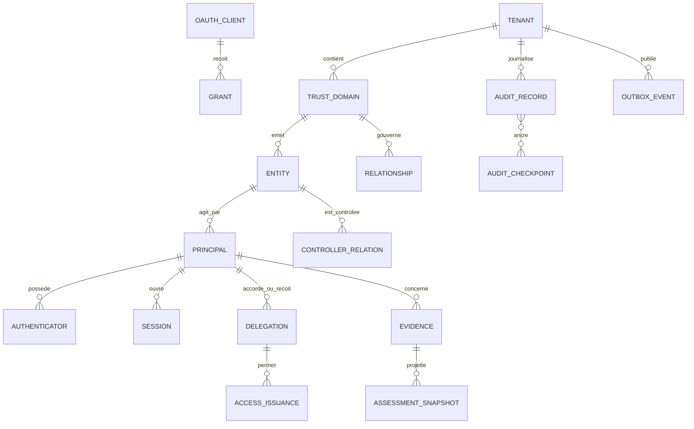
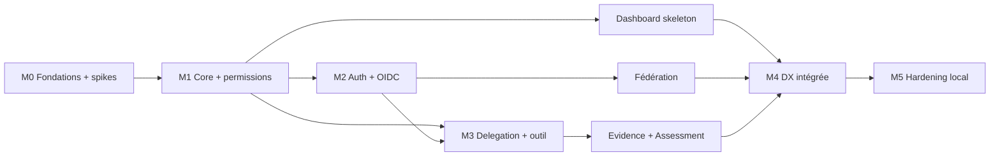

# AI ID — Phase 2 : contrats, exigences de sécurité et plan incrémental

**Statut :** plan de réalisation proposé à partir des ADR-001 à ADR-008 validées — la validation des ADR ne vaut pas validation de chaque détail de ce plan  
**Date de référence :** 26 septembre 2026  
**Document parent :** `phase-1-etude-et-architecture.md`  
**Portée :** contrats du MVP local, jalons M0 à M5, critères d'acceptation et portes de mise en production  
**Premier cas d'usage :** une API d'outil agentique non réglementée et réversible, appelée sous délégation explicite de profondeur zéro

---

> **Point d’étape — premier lot local :** ce document décrit la cible M0–M5, pas l’état du logiciel. Le [README](../../README.md) et le [bilan du lot 01](../implementation/lot-01.md) font foi pour les capacités testées et les écarts. Le lot local utilise trois processus et des clés de développement sur disque ; il ne satisfait pas encore la frontière Typed Signer/IAM d’ADR-005, ni le Token Exchange/PoP du plan. Ces exigences ne sont ni abandonnées ni considérées comme satisfaites. Aucun déploiement de production n’est autorisé par ce lot.

## 1. Décision de phase 2

Les ADR-001 à ADR-008 de la phase 1 sont considérées comme validées. Cette phase les transforme en contrats testables. Elle ne modifie pas la phase 1 et ne remplace aucune de ses limites : pas d'identifiant public mondial, pas de score universel, pas de sous-délégation dans le MVP, pas de blockchain ou de DID obligatoire, et pas de confusion entre authentification, autorisation, preuve et réputation.

Le livrable visé par M5 est un **MVP local de démonstration et d'intégration**, pas un service prêt à recevoir des identités réelles. La mise en production reste interdite tant que les exigences IAM, KMS/HSM, stockage WORM, PostgreSQL opéré, sauvegarde/restauration, tests de conformité, revue indépendante et exploitation décrites en section 18 ne sont pas satisfaites.

### 1.1 Règle de preuve et de communication

Un élément n'est « implémenté » que si les quatre preuves suivantes existent pour le même commit :

1. code versionné et configuration reproductible ;
2. test automatisé passant dans l'environnement de référence ;
3. contrat OpenAPI, JSON Schema ou AsyncAPI validé contre l'exécution ;
4. rapport ou artefact CI daté, conservant versions de runtime et dépendances.

La certification d'une bibliothèque ne se transmet pas automatiquement au produit qui l'intègre. En particulier, l'utilisation d'`oidc-provider`, `openid-client` ou SimpleWebAuthn n'autorise pas AI ID à se déclarer conforme ou certifié OIDC, OAuth, FAPI ou FIDO. Toute mention de conformité attend le passage d'une suite officielle applicable, avec la configuration exacte déployée.

### 1.2 Périmètre fonctionnel du MVP

Le chemin vertical de référence est le suivant :

1. un opérateur local crée un trust domain et une application ;
2. un humain crée ou reçoit une Entity et enregistre une passkey ;
3. une organisation contrôle un Agent Entity et son Agent Principal ;
4. le domaine de la ressource accorde des relations et permissions ;
5. l'humain crée une Delegation bornée, `max_depth = 0` ;
6. l'agent échange cette Delegation contre un access token court, lié à l'audience et à une clé ;
7. l'agent appelle une API de notes en sandbox ;
8. l'outil vérifie token, proof-of-possession et décision d'autorisation en ligne ;
9. l'outil écrit sa mutation réversible, son audit et son outbox dans une transaction ;
10. AI ID ingère une Evidence `tool.execution.v1`, puis produit une Assessment contextuelle informative ;
11. le dashboard permet de voir et de révoquer session, permission ou Delegation, puis de constater le refus de l'appel suivant.

L'outil de démonstration ne déclenche aucun paiement, envoi externe, action physique ou décision concernant emploi, crédit, santé, éducation, logement ou service public. Ses opérations `note.create`, `note.update` et `note.rollback` agissent uniquement dans un workspace sandbox et sont réversibles.

---

## 2. État initial et matrice « implémenté / planifié »

Cette matrice est intentionnellement prudente. `Planifié` signifie que ce document fixe une cible ; cela ne constitue pas une preuve d'exécution.

| Capacité | Cible | Statut au 26 septembre 2026 | Preuve requise pour passer à « implémenté » |
|---|---:|---|---|
| Architecture ADR-001 à ADR-008 | Phase 1 | **Validée** | Document de phase 1 accepté |
| Workspace TypeScript/Node.js 24 | M0 | **Planifié** | build, typecheck et tests CI |
| Fastify et contrats schema-first | M0 | **Planifié** | routes exécutées contre OpenAPI/JSON Schema |
| Adaptateur PostgreSQL `pg` | M0 | **Planifié** | tests d'intégration PostgreSQL natif |
| Adaptateur PGlite dev/test | M0 | **Planifié** | mêmes migrations et contrats de dépôt, tests rapides |
| Processus Core, Auth, Signer et Witness séparés | M0–M2 | **Planifié** | PIDs/identités/configurations distincts et test de droits négatifs |
| Mutation + audit + outbox atomiques | M0 | **Planifié** | fault-injection avant commit et après commit |
| Entity, Principal, Controller, trust domain | M1 | **Planifié** | API, invariants DB et tests cross-tenant |
| ReBAC par domaine et PDP/AuthZEN | M1 | **Planifié** | golden vectors permit/deny et tests de propriétés |
| OIDC Authorization Code + PKCE | M2 | **Planifié** | suite de protocole ciblée et E2E RP |
| Passkeys WebAuthn | M2 | **Planifié** | navigateur virtuel + tests challenge/replay/origin/RP ID |
| Sessions et refresh rotation | M2 | **Planifié** | concurrence, réutilisation et révocation |
| Typed Signer distant | M2 | **Planifié, risque technique** | spike `oidc-provider` external signing + tests d'oracle |
| Delegation profondeur zéro | M3 | **Planifié** | propriété d'atténuation et refus de tout parent/enfant |
| Token Exchange AI ID profile | M3 | **Planifié, extension à tester** | corpus RFC 8693 pertinent + tests négatifs AI ID |
| API d'outil sandbox réversible | M3 | **Planifié** | scénario create/update/rollback complet |
| Evidence `tool.execution.v1` | M3 | **Planifié** | validation schema, déduplication et correction append-only |
| Fédération OIDC entrante | M4 | **Planifié** | IdP de test hostile + liaison explicite sans email |
| API publique et SDK serveur | M4 | **Planifié** | consumer-driven contracts et quickstart E2E |
| Dashboard développeur | M4 | **Planifié** | mêmes APIs/permissions que tout autre client |
| Assessment `tool.execution.reliability.v1` | M4 | **Planifié** | projecteur déterministe et tests de recalcul |
| Checkpoints d'audit et témoin local | M4 | **Planifié** | inclusion/cohérence, fork et troncature détectés |
| Tests officiels OIDC applicables | M5 | **Planifié** | rapport attaché au commit/configuration |
| IAM workload, KMS/HSM et WORM production | Pré-lancement | **Non implémenté — bloquant production** | preuve opérateur, politiques IAM et exercice de compromission |
| Revue de sécurité indépendante | Pré-lancement | **Non réalisée — bloquant production** | rapport fermé ou risques explicitement acceptés |

---

## 3. Choix de stack et limites assumées

### 3.1 Runtime et langage

Le backend utilise **TypeScript strict, ESM natif et Node.js 24 LTS**. Node.js 24 est une ligne LTS au jour de référence ([calendrier officiel Node.js](https://nodejs.org/en/about/previous-releases)). Le repository fixe une version de patch et la met à jour par changement audité ; « 24 » n'autorise pas une mise à niveau silencieuse.

Les options TypeScript minimales sont `strict`, `noUncheckedIndexedAccess`, `exactOptionalPropertyTypes`, `useUnknownInCatchVariables` et `noImplicitOverride`. Les types ne remplacent pas la validation runtime : JSON Schema est canonique aux frontières réseau et événementielles.

**Pourquoi :** une seule pile pour API, workers, SDK et contrats réduit le coût cognitif ; Node possède un écosystème OAuth/OIDC/WebAuthn solide ; TypeScript permet de partager les types générés tout en gardant les validateurs runtime indépendants.

### 3.2 Serveur HTTP

Le Core, les APIs internes et l'outil de démonstration utilisent **Fastify v5**, pas une version majeure en préparation. La politique LTS officielle indique que Fastify 5 teste Node.js 24, tandis que Fastify 6 est encore une trajectoire distincte à la date de référence ([Fastify LTS](https://github.com/fastify/fastify/blob/main/docs/Reference/LTS.md)).

Fastify apporte :

- validation et sérialisation pilotées par JSON Schema ;
- faible surcharge et hooks explicites ;
- injection HTTP sans ouvrir de socket pour de nombreux tests ;
- logging structuré via Pino.

Le code métier ne dépend pas des objets Fastify. Chaque route adapte un contrat vers un use case ; les domaines restent testables sans HTTP.

### 3.3 Persistance

**PostgreSQL natif est la référence sémantique.** Le runtime de production utilise le driver `pg`, un pool borné, des requêtes paramétrées et des migrations SQL-first. La ligne production initiale cible PostgreSQL 18 sur le dernier patch supporté ; le projet PostgreSQL recommande de suivre les versions mineures et liste actuellement 18 comme supportée ([politique de version PostgreSQL](https://www.postgresql.org/support/versioning/)). Une montée majeure n'est jamais automatique.

**PGlite est exclusivement un accélérateur dev/test.** PGlite compile PostgreSQL en WASM mais fonctionne en mode mono-utilisateur/mono-connexion ; son propre projet documente cette limitation et le considère encore beta ([projet PGlite](https://github.com/electric-sql/pglite)). Par conséquent :

- PGlite peut exécuter tests unitaires de repositories, migrations et fixtures en processus unique ;
- le profil local rapide peut utiliser une base PGlite par processus propriétaire ;
- le profil local intégré, les tests E2E, concurrence, verrous, RLS, pool, crash et restauration utilisent PostgreSQL natif ;
- aucun test passant seulement sous PGlite ne valide un invariant de concurrence ou d'exploitation ;
- le binaire refuse de démarrer avec PGlite si `AIID_DEPLOYMENT_MODE=production`.

Les migrations sont identiques. Une migration non supportée par PGlite n'est pas affaiblie pour autant : le test rapide concerné est marqué PostgreSQL-only.

### 3.4 Protocoles d'identité

- **`oidc-provider` v9.x** fournit le moteur Authorization Server/OIDC. La version mineure est verrouillée, car les custom grants et l'external signing sont des surfaces sensibles. Le projet liste notamment OIDC, PKCE, introspection, révocation, Resource Indicators, RAR, DPoP, PAR et FAPI, mais toutes les fonctions ne sont pas activées par défaut ([fonctionnalités officielles](https://github.com/panva/node-oidc-provider)).
- **`openid-client` v6.x** est utilisé pour le RP de test et la fédération OIDC entrante. Il ne remplace pas nos règles de liaison, de trust et de SSRF.
- **SimpleWebAuthn v14.x** fournit les primitives serveur et navigateur pour les passkeys ; sa documentation demande Node LTS 22 ou supérieur ([documentation serveur](https://simplewebauthn.dev/docs/packages/server)). AI ID reste responsable du challenge, de l'origin, du RP ID, du compteur, de la récupération et du cycle de vie.

`oidc-provider` ne liste pas RFC 8693 parmi ses fonctions natives. Le Token Exchange est donc un **custom grant AI ID** enregistré explicitement, isolé dans un module et couvert par un corpus négatif. De même, le support de clés de signature externes d'`oidc-provider` est documenté comme expérimental. M0/M2 comportent une porte technique : si l'intégration distante ne permet pas les invariants du Typed Signer, la livraison s'arrête pour réévaluation ; on ne charge pas silencieusement une clé privée dans le Core ou l'Auth process.

### 3.5 Dépendances complémentaires

- `jose` pour vérification JOSE et golden vectors ; les appels de signature applicatifs passent par le Signer ;
- JSON Schema 2020-12 comme contrat canonique, OpenAPI 3.1 pour HTTP et AsyncAPI pour événements ;
- `pg` pour production et intégration, `@electric-sql/pglite` verrouillé exactement en dev/test ;
- OpenTelemetry pour traces/métriques, avec IDs pseudonymes et sans token ou PII ;
- un gestionnaire de migrations SQL déterministe ; son choix de package est réversible, les fichiers SQL restent la source.

Redis n'est pas une dépendance de vérité du MVP. Le replay cache, les epochs et les idempotency keys commencent dans PostgreSQL. Un cache distribué reconstructible sera ajouté seulement si la charge le justifie.

---

## 4. Découpage de repository et de processus

### 4.1 Modules proposés

```text
apps/
  core/                 API Entity, permissions, Delegation, Evidence
  auth/                 OIDC/OAuth, interactions, passkeys, sessions
  signer/               intentions de signature typées uniquement
  witness/              vérification/checkpoint et sortie WORM
  worker/               outbox, projecteurs, webhooks
  dashboard/            console développeur, aucun privilège implicite
  tool-demo/            API sandbox de notes réversibles
packages/
  contracts/            JSON Schema, OpenAPI, AsyncAPI, types générés
  domain/               agrégats et invariants sans HTTP/DB
  db/                   migrations et ports de persistance
  authz/                ReBAC/ABAC borné et adaptateur AuthZEN
  protocol/             configuration oidc-provider/openid-client
  sdk-node/             vérification RS, PDP, evidence et webhooks
  testing/              fixtures, horloge, clés et attaquants de test
```

Les noms décrivent des frontières ; ils ne garantissent pas que tous les dossiers existent déjà. Les dépendances autorisées vont des apps vers les packages, jamais d'un bounded context vers le repository SQL d'un autre contexte.

### 4.2 Isolation locale obligatoire

Même en développement, `core`, `auth`, `signer` et `witness` sont quatre processus OS distincts :

- ports, variables d'environnement et identités de base distincts ;
- le Core n'a accès ni au fichier de clé du Signer ni à la clé du Witness ;
- le Signer n'a aucune route générique `Sign(bytes)` ;
- le Witness ne peut pas modifier les lignes d'audit sources ;
- les interfaces internes écoutent uniquement sur loopback dans le profil local ;
- les tests vérifient explicitement qu'un processus ne peut pas utiliser les credentials DB ou fichiers d'un autre.

Le mode local utilise des clés de développement différentes par processus, stockées hors du repository et générées avec permissions minimales. Elles portent un marqueur `dev-only` et ne sont jamais importables en production. En production, l'identité réseau et workload repose sur IAM/mTLS ; les clés privées de signature résident dans KMS/HSM.

### 4.3 Domaines locaux et origines

Le profil intégré emploie HTTPS et des noms réservés sous `.localhost` :

| Surface | URL locale canonique | Rôle |
|---|---|---|
| Issuer et Hosted Authentication | `https://id.aiid.localhost` | OIDC/OAuth, passkeys et interactions |
| Core API | `https://api.aiid.localhost` | APIs propriétaires protégées |
| PDP AuthZEN | `https://pdp.aiid.localhost` | décision d'accès |
| Dashboard | `https://console.aiid.localhost` | client développeur |
| Outil sandbox | `https://tool.demo.aiid.localhost` | resource server de référence |

Un proxy local route ces noms vers les processus loopback. Une CA de développement distincte émet les certificats locaux ; son installation est explicite et réversible. Les tests unitaires peuvent injecter HTTP sans réseau, mais l'E2E navigateur utilise les URLs HTTPS exactes.

Le WebAuthn RP ID du profil est `id.aiid.localhost` et l'origin accepté est exactement `https://id.aiid.localhost`. Le cookie principal est host-only, `Secure`, `HttpOnly`, `SameSite=Lax`, `Path=/`, avec préfixe `__Host-`; aucun attribut `Domain` ne l'étend aux autres sous-domaines. Un changement futur de domaine ou RP ID exige ré-enrollment et migration explicite.

L'issuer OIDC est une constante exacte. Port, schéma, slash et proxy headers sont contrôlés ; le serveur refuse de démarrer si l'issuer configuré ne correspond pas au profil actif.

---

## 5. Modèle conceptuel et propriétaires de données

### 5.1 Vue des agrégats



### 5.2 Tables conceptuelles

| Objet | Champs minimaux | Invariants | Propriétaire |
|---|---|---|---|
| `tenant` | `tenant_id`, nom, région, statut, dates | frontière administrative, jamais issue du body seul | Control/Core |
| `trust_domain` | `trust_domain_id`, `tenant_id`, issuer, home cell, statut | namespace local ; issuer unique et non réassigné | Core |
| `entity` | `entity_id`, domaine, kind, état, profile minimal, version | ID aléatoire opaque ; tombstone non réassignable | Directory |
| `principal` | `principal_id`, `entity_id`, kind, custody mode, epoch, état | binding Entity immuable | Directory |
| `controller_relation` | controller, controlled entity, assurance, provenance, validité | ne donne aucun droit implicite | Directory |
| `federated_link` | domaine, principal, issuer, subject, dates | unicité `(domain, issuer, subject)` ; jamais par email | Authentication |
| `authenticator` | principal, credential ID, public key, counter, transports, backup flags, état | clé publique seulement ; cycle de vie explicite | Authentication |
| `session` | `sid`, principal, AAL, auth times, epochs, idle/absolute expiry, état | cookie opaque ; révocable | Session |
| `refresh_family` | famille, client, session, hash courant, génération, expiry, état | rotation one-time ; ancêtres révoqués | Session |
| `oauth_client` | client, domaine, redirects exactes, sector, JWKS, grants, état | aucun wildcard redirect ; auth method explicite | Developer/Auth |
| `relationship` | domaine ressource, resource type/id, relation, subject, condition, version | aucun parcours inter-domaines synchrone | Authorization |
| `policy_bundle` | domaine, version, règles, hash, état | déploiement monotone et refus par défaut | Authorization |
| `delegation` | grantor, delegate, client, resource authority, RAR, purpose, `cnf`, epochs, times, `max_depth` | `max_depth=0`, `parent_id=NULL`, une audience | Delegation |
| `evidence` | envelope, issuer, subject, schema, observed/ingested, commitments, status | append-only logique ; correction par référence | Evidence |
| `assessment_snapshot` | contexte, sujet/release, cutoff, model/version, result, counts, stale time | reproductible pendant rétention ; jamais permission MVP | Assessment |
| `audit_record` | tenant stream/seq, actor/subject, action, result, versions, previous hash, record hash | append-only logique, aucune donnée secrète | Ledger |
| `outbox_event` | event ID, aggregate/version, schema, payload minimisé, created/published | même transaction que mutation ; au moins une fois | Chaque propriétaire |
| `idempotency_record` | tenant, principal/client, route, key hash, request hash, response ref, expiry | aucune réponse rejouée à un autre principal | Chaque API |
| `audit_checkpoint` | partitions, heads, Merkle root, times, signer, witness receipt | signé puis témoigné par identité distincte | Witness |

Tous les enregistrements opérationnels portent `tenant_id`, `trust_domain_id` lorsque pertinent, `created_at`, `updated_at` et une version de concurrence. Les timestamps sont `timestamptz` UTC. Les identifiants sont générés dans l'application à partir d'au moins 128 bits aléatoires ; ni email, ni domaine, ni séquence DB ne devient identifiant de sécurité public.

### 5.3 Schémas PostgreSQL et rôles

La base intégrée sépare au minimum `control`, `directory`, `authn`, `authz`, `evidence`, `ledger`, `tool_demo` et `signer_log`. Chaque processus reçoit un rôle sans `BYPASSRLS` :

- `core_role` écrit Directory/Authz/Evidence et ses partitions Ledger ;
- `auth_role` écrit Authn et uniquement ses partitions Ledger/Outbox ;
- `tool_role` écrit `tool_demo` et son outbox ;
- `signer_role` n'écrit que son journal d'intentions ;
- `witness_role` lit les checkpoints finalisés et écrit seulement les accusés de témoignage ;
- `worker_role` lit les outbox avec droits de marquage limités, sans modifier les agrégats.

Chaque transaction applicative fait `SET LOCAL app.tenant_id = ...` depuis le contexte authentifié ; RLS constitue une défense supplémentaire. Le code ajoute aussi explicitement `tenant_id` aux requêtes. Les tests exécutent la même requête avec tenant différent et attendent zéro ligne, pas une simple erreur HTTP.

### 5.4 Contrat transactionnel audit/outbox

Toute mutation métier privilégiée suit cette transaction PostgreSQL unique :

```text
BEGIN
  verrouiller/valider agrégat et version attendue
  appliquer la mutation
  incrémenter version ou epoch si nécessaire
  insérer AuditRecord expurgé dans la chaîne du tenant
  insérer OutboxEvent versionné et minimisé
  enregistrer/résoudre IdempotencyRecord si la route l'exige
COMMIT
retourner le succès
```

Si l'audit ou l'outbox échoue, la mutation échoue. Aucun webhook, appel IdP, KMS ou réseau client n'a lieu dans cette transaction. Les consommateurs traitent `event_id` et `(aggregate_id, aggregate_version)` de manière idempotente. Un gap déclenche un refetch ; un événement ancien ne ressuscite jamais un état révoqué.

Un effet externe ne peut pas être rendu atomique avec PostgreSQL. Pour le Signer et le Witness, on emploie une saga idempotente à identifiant stable : intention `pending`, traitement, reçu `completed|failed`, puis finalisation chez l'appelant. Les orphelins sont réconciliés et audités ; le document ne prétend pas à une transaction distribuée.

---

## 6. Classes de sécurité chiffrées

Les valeurs ci-dessous sont des **plafonds**, pas des valeurs que le client peut augmenter. Une policy peut les réduire. Les tests utilisent une horloge injectable et vérifient chaque frontière à `TTL-1`, `TTL`, `TTL+1`.

### 6.1 Classes d'opérations

| Classe | Exemples | Access/action token max | Delegation max | Session / fraîcheur auth | Epoch/policy | Révocation maximale | Config négative stale max | Checkpoint / witness max |
|---|---|---:|---:|---|---|---|---:|---:|
| **P0 — public borné** | discovery, JWKS, liveness minimale | aucun droit | N/A | N/A | metadata cache 300 s | retrait de clé signalé immédiatement ; artefacts déjà émis selon leur TTL | 3 600 s seulement pour metadata non critique | N/A |
| **R1 — standard réversible** | exécution de l'outil sandbox, lecture ordinaire | 300 s | 900 s | idle 1 800 s, absolue 28 800 s ; auth ≤ 600 s pour créer une Delegation | check online pour `tool.execute`; cache max 15 s ailleurs | online p99 5 s, plafond 15 s ; validation purement offline au pire 300 s | 60 s sécurité, 900 s non critique | 60 s ou 1 000 records / 300 s |
| **S2 — sensible/admin** | client, redirect, relations, export, création/révocation de Delegation | 60 s | 300 s si applicable | idle 600 s, absolue 3 600 s ; step-up ≤ 300 s | online ou cache max 5 s | p99 2 s, plafond 5 s | 30 s | 30 s ou 100 records / 120 s |
| **C3 — critique** | récupération, compromission de clé, issuer/domain, support JIT, production config | 30 s, one-time | interdite | step-up ≤ 120 s, pas de refresh ; double contrôle production | lecture autoritative à chaque action, aucun stale | même transaction locale ; plafond 2 s pour propagation interne | 0 s : indisponible = refus | 15 s / 60 s |

Le premier appel agentique est R1, mais la création de sa Delegation est S2. Une Assessment n'élève jamais la classe.

### 6.2 Constantes protocolaires initiales

| Élément | Valeur maximale | Règle |
|---|---:|---|
| Authorization code | 60 s | usage unique, lié client/redirect/PKCE |
| WebAuthn challenge | 300 s | usage unique, hashé au repos, origin/RP ID exacts |
| Interaction OIDC | 600 s | cookie corrélé, CSRF et reprise bornée |
| `state` / `nonce` amont | 600 s | usage unique |
| DPoP proof age | 60 s | `htu`, `htm`, `iat`, `jti`, thumbprint vérifiés |
| DPoP replay entry | 300 s | même `jti` refusé même si requête identique |
| Clock skew accepté | ±60 s | surveillé ; jamais ajouté deux fois aux TTL |
| Refresh exact-retry grace | 5 s | même fingerprint/idempotency uniquement ; sinon famille révoquée |
| Refresh family R1 | 7 jours absolus | rotation à chaque usage ; idle max 24 h |
| Refresh family S2 | 24 h absolues | rotation à chaque usage |
| Idempotency record | 24 h | scope tenant + principal/client + route + body hash |
| Webhook timestamp tolerance | 300 s | delivery ID conservé 24 h pour rejeu |
| Evidence active submit | 300 s après `ended_at` | au-delà : voir section 12 |
| Outbox objectif | p99 10 s | alerte 30 s, backpressure à 300 s ou 100 000 rows |

### 6.3 Epochs et versions monotones

Les compteurs suivants sont des entiers 64 bits monotones : `principal_epoch`, `session_epoch`, `grant_epoch`, `delegation_epoch`, `resource_authz_epoch` et `policy_version`.

- toute révocation ou réduction de droit incrémente l'epoch dans la transaction de la mutation, avec audit/outbox ;
- les tokens portent les epochs nécessaires à leur classe, pas l'ensemble du graphe ;
- l'émission et le Token Exchange lisent la valeur autoritative ;
- le tool-demo appelle le PDP pour chaque `tool.execute` et ne se fie jamais au JWT seul ;
- valeur inconnue, gap, rollback ou snapshot trop ancien signifie `deny` ;
- une restauration rejoue tombstones et epochs post-snapshot avant de recevoir du trafic ;
- un compteur n'est jamais diminué, réutilisé ou remis à zéro lors d'un import.

La notification outbox accélère l'invalidation mais ne constitue pas la seule garantie. Pour un vérificateur offline générique R1, l'exposition maximale reste le TTL du token, soit 300 secondes. L'API d'outil du MVP choisit la vérification online et réduit ce plafond à 15 secondes.

### 6.4 Rotation de clés

- rotation planifiée de clé OIDC tous les 90 jours au plus, exercice local mensuel ;
- chevauchement de publication JWKS d'au moins 24 heures et jamais inférieur à `max token TTL + skew + cache TTL` ;
- `kid` unique pour la vie exacte d'une clé ;
- kill switch de compromission testé, distinct de la rotation normale ;
- refresh forcé sur `kid` inconnu, throttlé à un essai par issuer toutes les 30 secondes et protégé du stampede ;
- aucune clé de test ou de développement n'est acceptée lorsque `AIID_DEPLOYMENT_MODE=production`.

---

## 7. Surfaces HTTP et protection des endpoints

### 7.1 Règle générale

Tous les endpoints propriétaires du Core sont protégés. Les seules routes anonymes sont les métadonnées protocolaires qui doivent être publiques, les points d'entrée navigateur OIDC avec leur propre état transactionnel, et une liveness minimale sans détail. Un header `X-Tenant-ID` ne crée jamais un contexte de tenant.

| Surface | Exposition | Authentification/contrôle | Classe |
|---|---|---|---|
| `GET /.well-known/openid-configuration` | publique | issuer exact, cache borné, rate limit | P0 |
| `GET /.well-known/oauth-authorization-server` | publique | idem | P0 |
| `GET /jwks` | publique | clés publiques seulement, cache/rotation | P0 |
| `GET|POST /authorize` | publique protocolaire | client, redirect exacte, PKCE, interaction | R1/S2 |
| `POST /token` | publique protocolaire | grant-specific, client auth/PKCE, rate limit | R1/S2 |
| `POST /introspection`, `/revocation` | non anonyme | client authentifié et autorisé | S2 |
| `GET|POST /userinfo` | token | access token audience/scope/PoP | R1 |
| `/interaction/*` | navigateur | cookie court, CSRF, state OIDC, CSP | R1/S2 |
| `GET /livez` | publique minimale | retourne seulement vie du processus | P0 |
| `GET /readyz`, `/metrics` | interne | workload auth/réseau interne | S2 |
| `/v1/**` Core | protégée | access token + audience + PDP | R1 à C3 |
| `/internal/v1/**` | interne | identité workload, audience interne, allowlist | S2/C3 |

Dynamic Client Registration est désactivé dans le MVP. Les clients sont créés par l'API développeur protégée. Implicit et ROPC sont désactivés. Un client public utilise Authorization Code + PKCE S256 ; un client confidentiel utilise `private_key_jwt` ou mTLS selon le profil.

### 7.2 API propriétaire minimale

| Route cible | But | Permission | Particularités |
|---|---|---|---|
| `POST /v1/entities` | créer Entity + Principal optionnel | `entity:create` | Idempotency-Key, S2 |
| `GET /v1/entities/{id}` | lire profil minimal | `entity:read` | ETag, expurgation |
| `POST /v1/entities/{id}:tombstone` | supprimer logiquement | `entity:delete` | step-up, C3 selon kind |
| `POST /v1/relationships` | ajouter relation bornée | `relationship:write` | version/epoch, S2 |
| `POST /v1/relationships/{id}:revoke` | retirer relation | `relationship:revoke` | jamais DELETE silencieux |
| `POST /access/v1/evaluation` | contrat AuthZEN PEP→PDP | `authorization:evaluate` | seul `permit` devient `true` |
| `POST /v1/delegations` | créer Delegation | `delegation:create` | step-up, profondeur 0 |
| `POST /v1/delegations/{id}:revoke` | révoquer et incrémenter epoch | `delegation:revoke` | effet online ≤ 15 s R1 |
| `POST /v1/evidence` | ingérer envelope | `evidence:submit` | schéma/issuer/déduplication |
| `GET /v1/evidence/{id}` | lire métadonnées autorisées | `evidence:read` | payload non retourné par défaut |
| `POST /v1/evidence/{id}:dispute` | ajouter contestation | `evidence:dispute` | append-only |
| `GET /v1/assessments/{context}/{subject}` | lire projection | `assessment:read` | stale explicite |
| `GET /v1/audit-records` | exporter/chercher audit | `audit:read` | curseur, filtre borné, lecture auditée |

Les erreurs propriétaires utilisent RFC 9457 avec `type`, `title`, `status`, `code`, `request_id` et remédiation sûre. Les erreurs OAuth/OIDC restent dans leur format normatif. Les créations et transitions à effet sont idempotentes ; les mises à jour utilisent ETag/`If-Match`.

### 7.3 Contrat AuthZEN

Le point de décision expose la forme finale [Authorization API 1.0](https://openid.net/specs/authorization-api-1_0.html), sans promettre la conformité avant tests. Exemple du MVP :

```json
{
  "subject": {
    "type": "agent",
    "id": "prn_agent_01",
    "properties": {
      "on_behalf_of": "prn_human_01"
    }
  },
  "action": {
    "name": "tool.execute",
    "properties": {
      "operation": "note.update"
    }
  },
  "resource": {
    "type": "tool_workspace",
    "id": "ws_demo_01",
    "properties": {
      "trust_domain_id": "td_demo"
    }
  },
  "context": {
    "delegation_id": "dlg_01",
    "audience": "https://tool.demo.aiid.localhost",
    "dpop_jkt": "...",
    "request_time": "2026-09-26T12:00:00Z"
  }
}
```

La réponse wire reste `{ "decision": true|false }` avec un `context.aiid` optionnel contenant `decision_id`, `reason_codes`, `policy_version`, `relationship_snapshot`, `obligations` et `valid_until`. En interne, `deny`, `indeterminate` et `not_applicable` sont distincts ; tous deviennent `false`. Une obligation critique inconnue produit `false`.

---

## 8. Authentification humaine, sessions et fédération

### 8.1 Enrollment passkey

L'enrollment initial ne repose pas sur un endpoint anonyme de création de compte. Un administrateur autorisé crée un `enrollment_ticket` one-time, TTL 10 minutes, lié au trust domain, à l'Entity attendue et aux origins. En local, une fixture dev crée le premier opérateur ; cette fixture refuse de s'exécuter en production.

Le flow :

1. consommation atomique du ticket ;
2. challenge WebAuthn aléatoire TTL 300 secondes ;
3. `userVerification=required` ;
4. vérification RP ID/origin exacts, challenge, type, public key et flags ;
5. persistance credential ID/public key/counter/transports/backup flags ;
6. mutation + audit + outbox atomiques ;
7. création de session séparée seulement après commit.

Une Entity humaine peut enregistrer plusieurs passkeys. La suppression de la dernière passkey est C3 et indisponible tant qu'aucune méthode de récupération forte n'est définie. Le MVP local ne promet pas de récupération manuelle : seconde passkey ou recréation de fixtures seulement.

### 8.2 Sessions

Le navigateur reçoit uniquement `__Host-aiid_session`, valeur aléatoire opaque. La base conserve le hash de l'identifiant et les epochs. Rotation de session lors du login, step-up, changement de tenant actif et récupération. Les endpoints de mutation Hosted Auth appliquent Origin/Referer exacts, token CSRF lié à la session et CSP sans script inline arbitraire.

Les refresh tokens sont opaques, hashés, groupés par famille et rotatifs. Un retry strictement identique dans les 5 secondes peut recevoir le résultat mis en cache ; toute autre utilisation d'un ancêtre entraîne révocation de la famille, incrément d'epoch, audit et signal de risque.

### 8.3 OIDC sortant

Le profil MVP vise Authorization Code + PKCE S256, discovery, JWKS, UserInfo, introspection, révocation et RP-Initiated Logout. Les ID Tokens ne sont jamais acceptés comme access tokens. Les access tokens JWT suivent la structure RFC 9068 visée avec `typ=at+jwt`, issuer/audience exacts et claims minimaux ; cette phrase décrit une cible de test, pas une conformité déjà établie.

### 8.4 Fédération OIDC entrante

`openid-client` pilote discovery et Authorization Code + PKCE vers un issuer pré-enregistré. Aucun URL d'issuer fourni librement par un navigateur n'est résolu. Les métadonnées sont récupérées avec HTTPS, DNS/IP contrôlés, taille, timeout, redirections et cache bornés.

Le lien `(issuer, sub) → Principal` est créé seulement après :

- validation state, nonce, PKCE, issuer, audience et signature ;
- session AI ID fraîche ou ticket d'enrollment explicitement autorisé ;
- authentification fraîche auprès de l'IdP amont ;
- confirmation du lien et collision check ;
- mutation/audit/outbox atomiques.

Une égalité d'email, même `email_verified=true`, ne lie jamais deux identités automatiquement.

---

## 9. Signer typé

### 9.1 Interface interne

Le Signer n'accepte pas des octets arbitraires. Son contrat conceptuel est :

```json
{
  "intent_id": "sigint_...",
  "artifact_type": "oidc.id_token.v1",
  "tenant_id": "ten_...",
  "trust_domain_id": "td_...",
  "protected": "base64url(header)",
  "payload": "base64url(payload)",
  "requested_key_profile": "oidc-signing"
}
```

Le routeur authentifie le workload appelant. Le Signer décode sans accepter de paramètres dynamiques dangereux, choisit ou confirme `alg`/`kid`, vérifie `iss`, `aud`, `iat`, `exp`, `typ`, taille, classe TTL, tenant, profil de clé et quota. Chaque `artifact_type` possède son validateur et sa key policy :

- `oidc.id_token.v1` ;
- `oauth.access_token.v1` ;
- `audit.checkpoint.v1` — réservé au Witness, avec autre clé ;
- `evidence.receipt.v1` — ajouté après M3.

Le couple `intent_id + payload_hash` est idempotent. Réutiliser `intent_id` avec un autre hash est un incident. Le résultat et son hash sont journalisés avant d'être retournés. Les payloads complets ne sont pas copiés dans les logs.

### 9.2 Intégration `oidc-provider`

Le spike utilise `ExternalSigningKey` avec `externalSigningSupport`, actuellement documenté comme expérimental par le mainteneur. Les clés publiques doivent être connues au démarrage, mais `sign()` appelle le processus Signer. Critères de poursuite :

- aucun private JWK dans `auth` ou `core` ;
- aucun fallback automatique sur une clé mémoire ;
- comportement fail-closed si Signer indisponible ;
- golden vectors vérifiés indépendamment par `jose` ;
- rotation à deux clés et retrait d'urgence ;
- charge, timeout et retry idempotent ;
- aucun contournement des validateurs d'intention depuis une configuration `oidc-provider`.

Échec d'un de ces critères bloque M2 et exige une ADR complémentaire. Il est interdit de masquer le problème sous l'étiquette « seulement le MVP ».

---

## 10. Autorisation par domaine

### 10.1 Namespace et tuples

Chaque ressource appartient à exactement un `resource_trust_domain_id`. Les tuples sont locaux à ce domaine :

```text
tool_workspace:ws_demo_01#owner@principal:prn_human_01
agent:agent_notes_01#controller@organization:org_demo
tool_workspace:ws_demo_01#executor@agent:agent_notes_01
tool_workspace:ws_demo_01#rollback_operator@principal:prn_human_01
```

Permissions MVP :

- `entity:create|read|delete` ;
- `relationship:write|revoke` ;
- `delegation:create|revoke` ;
- `tool.execute` avec operation exacte ;
- `tool.rollback` ;
- `evidence:submit|read|dispute` ;
- `assessment:read` ;
- `audit:read`.

Une relation Controller ne crée pas automatiquement `tool.execute`. Le modèle compile relations + policy bundle + contexte en décision. Il n'existe aucun traversal synchrone vers un autre trust domain.

### 10.2 Composition des décisions

Une permission effective est l'intersection de :

```text
droits du grantor
∩ droits propres du delegate
∩ authorization_details de la Delegation
∩ audience et domaine de ressource
∩ policy bundle actif
∩ contraintes de contexte et proof-of-possession
```

Absence, stale, ambiguïté ou obligation inconnue équivaut à deny. Un `deny` explicite est prioritaire. La décision retourne un `decision_id` et les versions utilisées ; l'access token ne transporte pas le graphe complet.

---

## 11. Contrat Delegation et Token Exchange

### 11.1 Création

`POST /v1/delegations` reçoit au minimum :

```json
{
  "grantor_principal_id": "prn_human_01",
  "delegate_principal_id": "prn_agent_01",
  "client_id": "agent_notes_local",
  "resource_authority": "https://id.aiid.localhost/td/demo",
  "audience": "https://tool.demo.aiid.localhost",
  "authorization_details": [
    {
      "type": "aiid_tool_execution",
      "actions": ["note.update", "note.rollback"],
      "resource": "urn:aiid:tool-workspace:ws_demo_01",
      "purpose": "demo.note-maintenance"
    }
  ],
  "cnf": { "jkt": "..." },
  "expires_in": 900,
  "max_depth": 0
}
```

Le serveur ignore toute autorité implicite dans le body et résout tenant/domaine depuis la ressource et le contexte authentifié. Il exige une authentification humaine datant de moins de 5 minutes pour cette opération S2. `parent_id`, une seconde audience, une durée supérieure, une action inconnue ou un delegate non lié au client produisent un refus.

La réponse contient `delegation_id`, statut, bornes, `policy_version`, `decision_id` et un `delegation_grant` opaque retourné une seule fois. Seul son hash est stocké. Le grant est lié au delegate, au `client_id` et au `cnf.jkt`; sa fuite seule ne suffit pas à l'utiliser.

### 11.2 Échange

Le custom grant cible :

```text
grant_type=urn:ietf:params:oauth:grant-type:token-exchange
subject_token_type=urn:aiid:params:oauth:token-type:delegation-grant
subject_token=<opaque one-time-or-bound handle>
requested_token_type=urn:ietf:params:oauth:token-type:access_token
resource=https://tool.demo.aiid.localhost
```

Le client agent s'authentifie asymétriquement et présente une preuve DPoP correspondant au `cnf.jkt`. Le serveur relit Delegation, epochs, permission, policy et audience. Il n'émet aucun refresh token pour une Delegation. L'agent peut refaire un échange pendant les 15 minutes du grant, mais chaque access token expire au plus après 5 minutes.

Le token résultant représente :

- `sub` : le grantor pairwise pour cette ressource ;
- `act.sub` : l'Agent Principal effectif ;
- `client_id`, `aud`, `jti`, `iat`, `exp` ;
- référence `delegation_id` ;
- `cnf.jkt` ;
- epochs minimales et type d'autorisation borné.

L'API cible vérifie toujours `act`, Delegation et décision en ligne. Aucun token reçu n'est transmis à un outil aval ; un nouvel échange serait obligatoire.

### 11.3 Invariants testables

- `max_depth` vaut toujours zéro ;
- `parent_id` et `parent_hash` sont toujours absents ;
- exactement une resource authority et une audience ;
- chaque action émise appartient aux actions accordées ;
- le delegate et le DPoP key thumbprint correspondent au grant ;
- une révocation interdit l'échange immédiatement et l'exécution dans 15 secondes au plus ;
- aucune chaîne historique dans `act` n'accorde une permission ;
- une erreur de type de token, issuer, audience ou client échoue fermée.

---

## 12. Evidence `tool.execution.v1` et Assessment v1

### 12.1 Production atomique par l'outil

L'outil écrit dans une transaction PostgreSQL : la mutation de note, un receipt réversible, son audit local et un événement outbox `tool.execution.v1`. Le worker transmet ensuite l'envelope à AI ID. La duplication est normale ; `(issuer, execution_id)` est unique.

Exemple conceptuel :

```json
{
  "schema": "tool.execution.v1",
  "evidence_id": "ev_01",
  "issuer": {
    "uri": "https://tool.demo.aiid.localhost",
    "principal_id": "prn_tool_demo"
  },
  "subject": {
    "entity_id": "ent_agent_notes",
    "principal_id": "prn_agent_01",
    "agent_release": "sha256:..."
  },
  "context": {
    "trust_domain_id": "td_demo",
    "tool_id": "demo.notes",
    "operation": "note.update",
    "resource_class": "sandbox_note"
  },
  "execution": {
    "execution_id": "exec_01",
    "started_at": "2026-09-26T12:00:00Z",
    "ended_at": "2026-09-26T12:00:01Z",
    "outcome": "succeeded",
    "reversible": true,
    "rollback_deadline": "2026-09-27T12:00:01Z",
    "rollback_status": "available"
  },
  "authorization": {
    "delegation_id": "dlg_01",
    "decision_id": "dec_01",
    "policy_version": 7,
    "token_jti_hash": "sha256:..."
  },
  "commitments": {
    "input": "hmac-sha256:...",
    "output": "hmac-sha256:..."
  },
  "observed_at": "2026-09-26T12:00:01Z"
}
```

Les prompts, contenus de notes, tokens et paramètres bruts ne sont pas stockés dans l'Evidence ledger. Les commitments de valeurs à faible entropie sont HMACés avec une clé par tenant, pas simplement hashés. Le transport authentifié et la chaîne d'audit établissent l'intégrité MVP ; un receipt portable signé par le Typed Signer est une extension M4.

### 12.2 Fraîcheur, correction et rétention

- soumission dans les 5 minutes : Evidence `active` après validation ;
- entre 5 minutes et 24 heures : acceptée `late`, exclue de l'Assessment automatique jusqu'à réconciliation ;
- après 24 heures : refusée sauf import administratif S2 audité ;
- duplicat identique : succès idempotent ; duplicat de même ID avec contenu différent : incident `integrity_conflict` ;
- rollback : nouvelle Evidence référant l'exécution originale ; jamais de réécriture ;
- contestation/correction : nouvel événement et état dérivé ;
- fenêtre Assessment : 30 jours ; métadonnées Evidence MVP : 90 jours ; aucune conservation de contenu de note par AI ID.

### 12.3 Assessment informative

`tool.execution.reliability.v1` est calculée par `(trust_domain, tool_id, operation, agent_entity, agent_release)`. Elle contient les comptes `succeeded`, `failed`, `cancelled`, `rolled_back`, `rollback_failed`, `disputed`, la période, le cutoff, le nombre de jours actifs et la version de modèle.

Bandes déterministes initiales :

| Bande | Règle minimale |
|---|---|
| `unknown` | moins de 5 Evidence actives ou dernière activité > 7 jours |
| `observed` | au moins 5 Evidence sur au moins 2 jours actifs |
| `established` | au moins 20 Evidence, 5 jours actifs, réussite ≥ 95 %, aucune dispute ouverte et aucun rollback échoué |
| `attention` | conflit d'intégrité, rollback échoué, dispute ouverte ou 3 échecs consécutifs |

Ces seuils sont une heuristique produit, pas un modèle statistiquement calibré. L'API expose les comptes et les raisons. Le projecteur vise un retard ≤ 60 secondes ; au-delà de 15 minutes, l'Assessment est `stale` et retournée comme telle. Dans le MVP, elle est affichée mais n'entre jamais dans une décision d'autorisation.

---

## 13. Audit, outbox, checkpoints et WORM

### 13.1 Audit local

Chaque tenant possède une ou plusieurs chaînes partitionnées. Pour une partition, la transaction verrouille la tête puis calcule :

```text
record_hash = SHA-256(
  format_version || tenant_id || partition || sequence ||
  previous_hash || canonical_redacted_record
)
```

Le format canonique est versionné et couvert par golden vectors. L'audit contient actor, subject, controller qualifié, Delegation, action, resource, résultat, raison, request/client/session IDs pseudonymes, AAL, decision/policy/evidence versions et diff expurgé. Aucun secret, token, credential complet, prompt ou contenu de note.

### 13.2 Checkpoints et Witness

Le worker construit un checkpoint lorsque la première limite est atteinte : délai de la classe ou nombre de records. Le Witness indépendant :

1. relit les têtes et vérifie la cohérence depuis le checkpoint précédent ;
2. refuse fork, trou, séquence décroissante ou format inconnu ;
3. signe un reçu avec une clé distincte ;
4. écrit localement dans un fichier append-only dev ;
5. en production, écrit obligatoirement dans un stockage WORM sous IAM séparé.

Le fichier append-only de développement ne vaut pas WORM et ne doit jamais être présenté comme tel.

### 13.3 Outbox

Le worker publie au moins une fois. Après 30 secondes de retard, une alerte locale est levée ; après 5 minutes ou 100 000 lignes non publiées, les mutations non essentielles sont rejetées et les mutations de sécurité restent prioritaires. Une purge n'intervient qu'après confirmation du consommateur et rétention minimale de 7 jours dans le profil local intégré.

---

## 14. Modèle de menace ciblé du MVP

### 14.1 Actifs et frontières

Actifs critiques : clés de signature, passkeys publiques et bindings, sessions/refresh families, relations, Delegations, epochs, politiques, Evidence, audit, données tenant et configurations client. Les frontières sont navigateur↔Auth, agent↔token endpoint, agent↔outil, outil↔PDP, services↔Signer, DB↔processus, worker↔destinations et Witness↔stockage.

Adversaires considérés : client malveillant, tenant hostile, agent compromis, outil compromis, IdP amont hostile, attaquant réseau hors TLS, supply-chain compromise partielle, opérateur interne abusif et RCE d'un seul processus. Le MVP local ne prétend pas résister à un administrateur ayant compromis simultanément OS, tous les processus et toutes les clés dev.

### 14.2 Menaces et tests obligatoires

| Menace | Exemple ciblé | Contrôle | Test de sortie |
|---|---|---|---|
| Cross-tenant / IDOR | l'agent du tenant A fournit l'ID de B | tenant dérivé, RLS, query scoping | matrice générative sur chaque route |
| OAuth mix-up/code injection | code d'un autre issuer/client | issuer exact, PKCE, nonce/state, redirects exactes | corpus protocolaire négatif |
| Passkey replay/origin confusion | assertion rejouée depuis autre origin | challenge one-time, RP ID/origin, counter/flags | replay et origins voisins refusés |
| Session/refresh theft | deux rotations concurrentes | hash, CAS, grâce 5 s exacte, reuse detection | course contrôlée à N requêtes |
| Token substitution | ID Token ou token autre audience | `typ`, issuer, aud/resource, key use | golden corpus cross-token |
| DPoP replay | même proof sur deux appels | `htu`, `htm`, `iat`, `jti`, cache | second appel refusé |
| Delegation laundering | agent masque grantor | `sub` + `act`, grant référence, audit | acteur/grantor manquant refusé |
| Scope inflation | action demandée hors grant | intersection et RAR exact | property test `issued ⊆ granted` |
| Sous-délégation | parent injecté malgré profondeur 0 | schéma + invariant DB + policy | tout `parent_id` refusé |
| Confused deputy | token notes utilisé sur autre outil | audience/resource et PDP online | multi-audience adversarial |
| Prompt/tool injection | prompt demande une action hors autorité | outil borné, validation args, aucune permission par contenu | payloads red-team n'étendent pas l'action |
| Evidence forgery/replay | faux succès ou même execution ID modifié | issuer auth, unique ID, commitments, ledger | duplicate-different = incident |
| Reputation poisoning | rafale de succès artificiels | contexte/release, source unique visible, seuils, pas d'effet authz | simulation et recalcul déterministe |
| Signing oracle | Core RCE demande JWT arbitraire | Signer distant typé, claims/TTL allowlists | intentions malformées refusées |
| Audit suppression/fork | suppression de records avant checkpoint | hash chain, Merkle, Witness séparé | trous/forks/troncatures détectés |
| Outbox duplicate/loss | crash autour du commit/publish | atomicité + at-least-once + idempotence | kill avant/après commit |
| Federation account linking | même email chez IdP hostile | liaison fraîche explicite `(iss,sub)` | issuer hostile ne prend pas le compte |
| SSRF metadata/webhook | issuer ou callback vers metadata IP | allowlists, DNS/IP, egress broker | corpus loopback/link-local/rebinding |
| DB rollback/backup resurrection | restauration réactive une Delegation | journal epochs/tombstones post-snapshot | restore drill avant trafic |
| PGlite false confidence | test mono-connexion masque une race | PostgreSQL natif autoritatif | test CI échoue si suite PG absente |
| Dev backend in production | PGlite/clé fichier/no-op WORM | boot guard et attestation config | démarrage production refusé |

### 14.3 Non-objectifs sécurité du MVP local

- récupération manuelle universelle ;
- preuve d'identité légale/KYC ;
- attestation matérielle ou SPIFFE complet ;
- multi-région et tolérance Byzantine ;
- fonctionnement offline de l'outil avec révocation instantanée ;
- protection contre compromission simultanée de toute la machine locale ;
- décisions réglementées ou réputation utilisable pour sanctionner une personne.

---

## 15. Stratégie de tests et définition de « done »

### 15.1 Pyramide obligatoire

1. **Unitaires domaine :** state machines, TTL, attenuation, epochs, redaction.
2. **Property-based :** `child ⊆ parent`, monotonicité, idempotence, isolation tenant, événements dupliqués.
3. **Contract :** JSON Schema/OpenAPI/AsyncAPI, consumer-driven contracts SDK/dashboard/tool.
4. **Intégration PGlite :** repositories et migrations rapides, sans claims de concurrence.
5. **Intégration PostgreSQL natif :** isolation, RLS, locks, serializable retries, pools, crash et migrations.
6. **Protocolaires :** OIDC/OAuth/WebAuthn/DPoP/JWT avec corpus positif et hostile.
7. **E2E navigateur :** passkey virtuelle, login, consent, dashboard et révocation.
8. **Fault/chaos local :** Signer, Witness, worker, DB et IdP indisponibles.
9. **Conformité externe :** seulement M5, pour les profils effectivement annoncés.

### 15.2 Matrices minimales

- chaque route Core : sans token, mauvais issuer, mauvaise audience, mauvais tenant, permission absente, token expiré, epoch stale, succès ;
- chaque mutation : succès, retry identique, retry body différent, rollback transactionnel, duplicate event ;
- chaque artefact JWT : mauvais `typ`, alg, `kid`, signature, `iss`, `aud`, `iat`, `exp`, `jti` ;
- chaque Delegation : durée, audience, action, resource, delegate, DPoP, status, epoch, profondeur ;
- chaque Evidence : schéma, issuer, freshness, duplicate, conflict, rollback, dispute ;
- chaque processus : credentials du voisin refusés.

### 15.3 Definition of Done d'une capacité

Une capacité est done seulement si :

- ses invariants et sa classification sécurité sont documentés ;
- schémas et migrations sont versionnés ;
- happy path et attaques prioritaires passent sous PostgreSQL natif ;
- mutation, audit et outbox sont présents lorsque requis ;
- logs/traces sont testés contre la fuite de secrets ;
- métriques et alertes minimales existent ;
- rollback/migration arrière ou stratégie de correction est définie ;
- le tableau d'état pointe vers un rapport vérifiable.

---

## 16. Plan incrémental M0 à M5

Les durées sont des ordres de grandeur pour une petite équipe expérimentée, pas des engagements. La sécurité du chemin critique ne doit pas être compressée pour tenir une date.

### M0 — Fondations exécutables et spikes de risque

**Objectif :** rendre les contrats compilables et lever les risques PGlite/PostgreSQL, process isolation et external signing avant le produit.

**Livrables :**

- workspace TypeScript ESM, Node 24 fixé, lint/typecheck/tests ;
- packages `contracts`, `domain`, `db`, `testing` ;
- JSON Schemas initiaux et OpenAPI vide mais validé ;
- migrations `tenant`, `trust_domain`, `audit_record`, `outbox_event`, `idempotency_record` ;
- adaptateurs PGlite et `pg`, avec PostgreSQL natif dans l'intégration ;
- transaction commune mutation/audit/outbox ;
- processus séparés `core`, `auth`, `signer`, `witness` avec endpoints internes stub deny-by-default ;
- proxy/domaines HTTPS locaux ;
- boot guards production contre PGlite, clés fichiers et WORM no-op ;
- spike `oidc-provider` → `ExternalSigningKey` → Signer distant ;
- registre de dépendances, licences, SBOM initiale et versions verrouillées.

**Critères d'acceptation :**

- les quatre processus ont PIDs, ports, DB roles et secrets différents ;
- Core ne peut pas lire la clé Signer et Signer ne peut pas écrire Directory ;
- une faute injectée après mutation mais avant audit/outbox ne laisse aucune ligne ;
- une faute après commit livre une seule conséquence métier malgré plusieurs publications ;
- mêmes migrations et repository tests passent PGlite et PostgreSQL lorsque applicables ;
- les tests de concurrence ne peuvent pas être marqués passés sans profil PostgreSQL ;
- le mode production refuse chaque backend dev ;
- le spike de signature respecte les critères de section 9.2, sinon M0 reste ouvert.

**Dépendances :** aucune.  
**Estimation :** 1 à 2 semaines.

### M1 — Directory, trust domains, permissions et ledger

**Objectif :** disposer d'un Core multi-tenant protégé avant tout login réel.

**Livrables :**

- Entity, Principal, Controller, OAuth client administré et tombstones ;
- seed local strictement dev du tenant/domaine/opérateur ;
- relations ReBAC par resource trust domain ;
- policy bundle versionné, PDP interne et adaptateur `/access/v1/evaluation` ;
- endpoints Entity/Relationship protégés, RFC 9457, ETag et idempotency ;
- chaîne d'audit par tenant et worker outbox minimal ;
- tests RLS/scoping et refus cross-domain.

**Critères d'acceptation :**

- aucune route Core métier n'est accessible anonymement ;
- `tenant_id` du body/header ne change jamais le contexte effectif ;
- un Principal reste lié à une seule Entity ;
- un Entity ID tombstoned ne peut pas être réutilisé ;
- un tuple d'un autre domaine n'accorde aucune permission ;
- permit, deny, indeterminate et obligation inconnue suivent la section 7.3 ;
- chaque mutation observable possède audit et outbox dans le même commit.

**Dépendances :** M0.  
**Estimation :** 2 semaines.

### M2 — Passkeys, sessions et OIDC local

**Objectif :** authentifier un humain et fournir une session/OIDC sûre sur le domaine local.

**Livrables :**

- Hosted Authentication dans le process Auth ;
- tickets d'enrollment, SimpleWebAuthn registration/authentication ;
- root sessions, cookies, CSRF, step-up et révocation ;
- `oidc-provider` avec adapter PostgreSQL, code + PKCE, discovery, JWKS, UserInfo, introspection, révocation et logout ciblés ;
- refresh rotation/reuse detection ;
- Typed Signer distant et rotation à deux clés ;
- RP de test fondé sur `openid-client` ;
- premières suites protocolaires et E2E passkey.

**Critères d'acceptation :**

- origin/RP ID/challenge incorrects ou rejoués sont refusés ;
- implicit, ROPC et redirects wildcard sont impossibles ;
- ID Token utilisé sur Core est refusé ;
- access token autre audience ou mauvais `typ` est refusé ;
- course de refresh : au plus un résultat logique, reuse hostile révoque la famille ;
- révocation de session R1 respecte 15 secondes ;
- Auth/Core n'ont aucune clé privée de signature ;
- une panne Signer empêche l'émission mais pas la validation de tokens encore valides.

**Dépendances :** M1 et spike Signer M0.  
**Estimation :** 2 à 3 semaines.

### M3 — Vertical slice agent, Delegation et Evidence

**Objectif :** démontrer la différenciation AI ID sur un outil agentique réversible.

**Livrables :**

- Agent Entity, Agent Principal, client asymétrique et controller qualifié ;
- création/révocation de Delegation S2, `max_depth=0` ;
- custom Token Exchange et DPoP ;
- tool-demo notes avec `create`, `update`, `rollback` ;
- PDP online sur chaque exécution ;
- transaction outil + receipt + audit + outbox ;
- ingestion Evidence `tool.execution.v1` idempotente ;
- vue d'audit causale grantor→agent→outil.

**Critères d'acceptation :**

- scénario complet passkey→Delegation→exchange→update→Evidence→rollback passe ;
- aucune action/audience/resource hors grant n'est émise ou exécutée ;
- tout parent ou profondeur >0 est refusé au schema, domaine et DB ;
- DPoP rejoué ou signé par autre clé est refusé ;
- un token transmis à une autre audience est refusé ;
- révocation empêche l'appel suivant en 15 secondes au plus ;
- double delivery Evidence ne crée qu'une Evidence ; contenu divergent crée un incident ;
- aucun prompt ou contenu de note n'apparaît dans logs, audit ou Evidence.

**Dépendances :** M1 + M2.  
**Estimation :** 2 semaines.

### M4 — Fédération, API/SDK, dashboard et Assessment

**Objectif :** rendre le MVP intégrable et observable par un développeur tiers.

**Livrables :**

- fédération OIDC entrante via `openid-client`, issuer allowlist et linking explicite ;
- OpenAPI/AsyncAPI publiés et SDK Node fin ;
- vérificateur resource server : issuer/audience/JWKS/DPoP + client AuthZEN ;
- dashboard consommant exactement les APIs protégées ;
- gestion clients/redirects, Entities, relations, Delegations, Evidence et audit ;
- projecteur `tool.execution.reliability.v1`, stale/dispute/correction ;
- checkpoints Merkle, Witness local et reçus exportables ;
- webhooks signés et egress protections si activés.

**Critères d'acceptation :**

- un IdP hostile ne peut pas lier un compte par email ;
- discovery vers IP privée/link-local ou redirect hostile est bloquée ;
- le quickstart SDK exécute le vertical slice sans parser des claims non contractuels ;
- le dashboard n'a aucune route ou DB credential privilégié caché ;
- l'Assessment se recalcule au même résultat depuis le même cutoff/model ;
- Assessment stale devient explicitement stale et n'autorise rien ;
- suppression, fork et troncature d'audit sont détectés par le Witness.

**Dépendances :** M2 pour fédération ; M1 pour dashboard ; M3 pour Evidence/Assessment.  
**Estimation :** 2 à 3 semaines.

### M5 — Durcissement, conformité mesurée et release candidate locale

**Objectif :** obtenir un artefact local reproductible, honnête sur ses garanties et prêt pour revue externe.

**Livrables :**

- suites adversariales complètes et tests officiels applicables ;
- fuzz des parsers JWT/JWK/metadata/evidence ;
- load/fault tests, budgets de timeouts et backpressure ;
- restore drill avec epochs/tombstones post-snapshot ;
- rotation/compromission de clé et rotation de CA dev ;
- SBOM, provenance de build, images signées et scans ;
- documentation opérateur, incident, export/suppression et matrice exacte de standards ;
- rapport de gaps production et backlog priorisé.

**Critères d'acceptation :**

- installation locale depuis zéro, scénario E2E et teardown sont reproductibles ;
- tous les seuils section 6 ont tests/mesures ;
- aucun secret n'est détecté dans repository, logs ou artefacts ;
- l'arrêt d'un composant produit le mode dégradé documenté, jamais un permit implicite ;
- restauration ne réactive aucune session, Delegation, clé ou relation révoquée ;
- chaque claim de compatibilité renvoie vers un rapport ; les profils non testés sont marqués non vérifiés ;
- la checklist production reste rouge tant que section 18 n'est pas satisfaite.

**Dépendances :** M0 à M4.  
**Estimation :** 2 à 4 semaines.

---

## 17. Dépendances et chemin critique



Le chemin critique est M0 Signer/DB → M1 invariants → M2 authentification → M3 vertical slice → M4 intégration → M5 durcissement. Le dashboard visuel peut avancer après stabilisation des contrats M1, mais il ne doit pas inventer d'endpoint ou de permission. L'Assessment peut être développée en parallèle du SDK après stabilisation d'`tool.execution.v1`.

### 17.1 Ordre de migration des données

1. schéma et migrations ;
2. contraintes et RLS ;
3. code capable de lire ancien + nouveau si nécessaire ;
4. backfill idempotent ;
5. activation d'écriture ;
6. vérification ;
7. retrait ultérieur de l'ancien champ.

Une migration destructive n'est jamais couplée au même déploiement que le premier code qui cesse de lire l'ancien format.

---

## 18. Porte obligatoire avant toute production

Le MVP local ne doit pas être exposé comme service public. Un lancement exige au minimum :

### Identités et clés

- IAM workload par processus, authentification mTLS ou mécanisme cloud équivalent ;
- KMS/HSM par usage, tenant/domaine/environnement/région ;
- aucune clé privée fichier ou variable d'environnement ;
- cérémonies de rotation, retrait et compromission exercées ;
- double contrôle pour C3.

### Données

- PostgreSQL natif opéré, haute disponibilité adaptée, TLS, rôles minimaux, PITR ;
- sauvegardes chiffrées et restore drill mesuré ;
- WORM réel pour checkpoints/receipts, IAM séparé du service et du Witness ;
- secrets manager et chiffrement d'enveloppe ;
- rétention, export, suppression et base légale revus.

### Réseau et exploitation

- gateway/WAF/rate limit distribué, egress broker SSRF-safe ;
- observabilité sans PII, alerting 24/7 proportionné et runbooks ;
- SLO/RPO/RTO approuvés ;
- incident response, kill switches et astreinte ;
- séparation environnements et impossibilité cryptographique d'accepter les credentials test.

### Assurance

- suites officielles applicables passées sur la configuration de production ;
- pentest et revue protocolaire indépendants ;
- threat model mis à jour et risques ouverts acceptés explicitement ;
- dependency/SBOM/provenance/signature de build ;
- revue confidentialité/juridique ;
- aucune mention marketing « conforme », « certifié », « vérifié » ou « trusted » sans périmètre et preuve.

Le binaire production doit vérifier au démarrage un manifeste signé de capacités opérateur. L'absence de KMS, WORM, IAM workload ou PostgreSQL natif est une erreur fatale, pas un warning.

---

## 19. Décisions fermées et points à revalider

### Décisions fermées pour le MVP

- TypeScript/Node.js 24, ESM, Fastify 5 ;
- PostgreSQL comme référence, `pg` en production/intégration ;
- PGlite uniquement dev/test, jamais preuve de concurrence ou production ;
- `oidc-provider`/`openid-client` pour les protocoles, SimpleWebAuthn pour les passkeys ;
- domaines HTTPS `.localhost` et RP ID figé pour le profil local ;
- quatre processus de sécurité séparés dès le développement ;
- toutes les mutations privilégiées avec audit/outbox atomiques ;
- permission locale au domaine de ressource ;
- Delegation de profondeur zéro, une audience et DPoP ;
- Evidence v1 limitée à `tool.execution.v1` ;
- Assessment informative, jamais décisionnelle ;
- aucun claim de conformité sans rapport.

### Portes de réévaluation

- external signing `oidc-provider` ne satisfait pas les invariants ;
- le custom Token Exchange ne peut pas être isolé/testé sans fork fragile ;
- PGlite diverge des migrations au point de masquer plus d'erreurs qu'il n'accélère de tests ;
- le premier client exige sous-délégation, offline ou multi-resource ;
- le use case cesse d'être non réglementé et réversible ;
- le dashboard nécessite un privilège non exprimable par l'API publique ;
- la production est demandée avant les contrôles section 18.

Dans chacun de ces cas, une ADR additionnelle est requise avant de poursuivre.

---

## 20. Sources techniques vérifiées pour les choix de stack

- [Node.js release schedule](https://nodejs.org/en/about/previous-releases)
- [Fastify LTS policy](https://github.com/fastify/fastify/blob/main/docs/Reference/LTS.md)
- [`oidc-provider` — fonctionnalités et versions supportées](https://github.com/panva/node-oidc-provider)
- [`oidc-provider` — guide external signing/KMS, fonctionnalité expérimentale](https://github.com/panva/node-oidc-provider/discussions/1316)
- [`openid-client`](https://github.com/panva/openid-client)
- [SimpleWebAuthn server](https://simplewebauthn.dev/docs/packages/server)
- [PGlite — architecture et limite mono-utilisateur](https://github.com/electric-sql/pglite)
- [PostgreSQL versioning policy](https://www.postgresql.org/support/versioning/)
- [OpenID AuthZEN Authorization API 1.0](https://openid.net/specs/authorization-api-1_0.html)
- [OAuth 2.0 Security Best Current Practice — RFC 9700](https://www.rfc-editor.org/info/rfc9700/)
- [OAuth 2.0 Token Exchange — RFC 8693](https://www.rfc-editor.org/info/rfc8693/)
- [DPoP — RFC 9449](https://www.rfc-editor.org/info/rfc9449/)

---

## Conclusion

Le plan choisit une progression où chaque jalon produit un invariant vérifiable, pas seulement une nouvelle interface. M0 élimine les risques de fondation ; M1 construit l'autorité par domaine ; M2 ajoute l'authentification humaine et les sessions ; M3 démontre la délégation agentique et l'Evidence ; M4 rend le système intégrable ; M5 mesure ses garanties et prépare la revue.

Le résultat attendu n'est pas « beaucoup de endpoints ». C'est une preuve locale, reproductible et auditable qu'un humain peut déléguer une action précisément bornée à un agent, que l'outil peut décider et exécuter sans confused deputy, que la révocation a une borne mesurée, et que l'exécution produit une Evidence contextuelle sans devenir un score universel.
